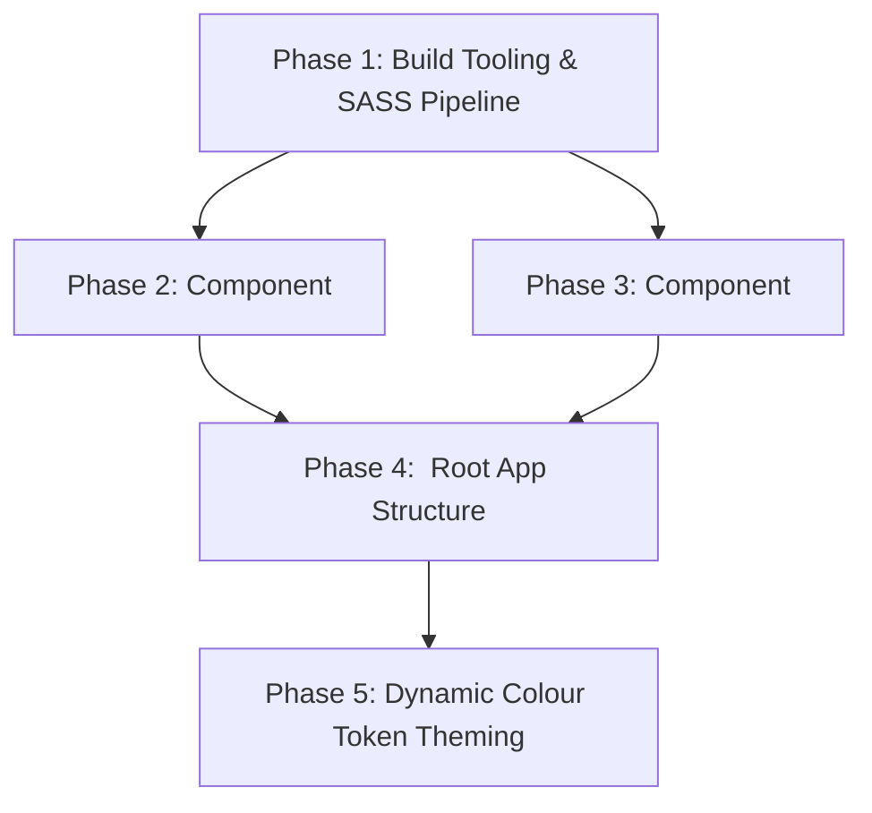

# Anima 0.1 Implementation Roadmap & Specifications

Based on the architectural specifications defined in [`docs/0.1.md`](./0.1.md), this document details the phased implementation roadmap for the Anima 0.1 interactive demo page, custom Web Components, and Rollup build pipeline.

---

## 1. Dependency Graph

---

## 2. Phased Implementation Plan

### Phase 1: Build Tooling & SASS Pipeline

**Goal**: Configure Rollup bundling, dependency declarations, and the inline `litCssPlugin` mirroring `protoboard3` to enable SASS `.scss` compilation directly into Lit component styles.  
**Dependencies**: None.

- [x] **1. Phase 1: Build Tooling & SASS Pipeline**
  - [x] **1.1 Dependencies & Package Scripts (`package.json`)**
    - [x] 1.1.1 Add dependencies: `lit`, `@lit-labs/signals`, `sass`.
    - [x] 1.1.2 Add Rollup devDependencies: `rollup`, `@rollup/plugin-typescript`, `@rollup/plugin-node-resolve`, `@rollup/plugin-commonjs`, `@rollup/plugin-terser`.
    - [x] 1.1.3 Add scripts: `"build:demo": "rollup -c"`, `"start": "npx serve dist/demo"`.
  - [x] **1.2 Rollup Configuration (`rollup.config.mjs`)**
    - [x] 1.2.1 Configure `localPkgsResolver` for `gs-tools/export/*` resolution.
    - [x] 1.2.2 Implement `litCssPlugin` to compile `.scss` strings using `sass.compileString` and export them wrapped in Lit's `css` template tag.
    - [x] 1.2.3 Configure bundle targets for `src/demo/main.ts` outputting to `dist/demo/bundle.js`.
  - [x] **1.3 TypeScript Compilation (`tsconfig.json`)**
    - [x] 1.3.1 Ensure `tsconfig.json` supports experimental decorators or standard Lit decorator compilation and imports from `.scss`.
    - [x] 1.3.2 Add type declarations for `.scss` module imports (`src/declarations.d.ts`).
  - [x] **1.4 Documentation Updates (`README.md`, `src/README.md`)**
    - [x] 1.4.1 Update root `README.md` to document new build scripts and `docs/` subdirectories.
    - [x] 1.4.2 Update `src/README.md` to document the `demo/` subdirectory.

---

### Phase 2: `<an-color-picker>` Component

**Goal**: Implement the autonomous RGB color picker Web Component with range sliders, numeric inputs, live hex parsing, preview swatch, and input-like `.value` interface.  
**Dependencies**: Phase 1.

- [x] **2. Phase 2: <an-color-picker> Component**
  - [x] **2.1 Component Styling (`src/demo/component/color-picker/color-picker.scss`)**
    - [x] 2.1.1 Define color-only styles for red, green, and blue slider rows and synced numeric inputs (no decorative shadows or rounded containers).
    - [x] 2.1.2 Define color-only styles for the hex text input field with normal, focus, and invalid validation states.
    - [x] 2.1.3 Define color-only styles for the live color preview swatch box.
  - [x] **2.2 Component Implementation (`src/demo/component/color-picker/color-picker.ts`)**
    - [x] 2.2.1 Define `export type RgbChannel = 'r' | 'g' | 'b';`.
    - [x] 2.2.2 Extend `LitElement` with `SignalWatcher` from `@lit-labs/signals`.
    - [x] 2.2.3 Implement reactive signals `r`, `g`, and `b` (0–255, defaulting to 0) without `Signal` suffix.
    - [x] 2.2.4 Implement computed signals `rgbColor` and `hex` using `gs-tools/export/color`.
    - [x] 2.2.5 Implement `rawHex` state signal and `isHexValid` computed signal evaluating hex validity.
    - [x] 2.2.6 Implement `.value` getter/setter: accept any `Color`, convert via `convert(val, 'rgb')`, and update RGB signals.
    - [x] 2.2.7 Implement split event dispatchers: `dispatchInputEvent()` for active drag/typing and `dispatchChangeEvent()` for committed changes.
    - [x] 2.2.8 Implement slider and numeric input handlers accepting `channel: RgbChannel`.
    - [x] 2.2.9 Implement hex input handler with live parsing and blur validation.
    - [x] 2.2.10 Register custom element as `an-color-picker`.
  - [x] **2.3 Unit & Visual Testing (`src/demo/component/color-picker/color-picker.test.ts`)**
    - [x] 2.3.1 Test setting `.value` with `oklch(...)` or `rgb(...)` correctly updates slider positions and hex text.
    - [x] 2.3.2 Test slider interactions fire standard `'input'` and `'change'` events.
    - [x] 2.3.3 Test hex typing updates RGB signals and invalid hex marks error state on blur.
    - [x] 2.3.4 Capture visual screenshot golden for `<an-color-picker>`.
  - [x] **2.4 Directory Documentation (`src/demo/component/color-picker/README.md`)**
    - [x] 2.4.1 Document `color-picker.ts` and `color-picker.scss`.

---

### Phase 3: `<an-palette-preview>` Component

**Goal**: Implement the swatch preview Web Component rendering the 9 generated palette shades (`c100` through `c900`), displaying hex values below swatches, and rendering no DOM nodes if palette is null.  
**Dependencies**: Phase 1.

- [x] **3. Phase 3: <an-palette-preview> Component**
  - [x] **3.1 Component Styling (`src/demo/component/palette-preview/palette-preview.scss`)**
    - [x] 3.1.1 Define color-only layout for 9 shade swatch cards.
    - [x] 3.1.2 Style hex text label so it is displayed below each swatch.
  - [x] **3.2 Component Implementation (`src/demo/component/palette-preview/palette-preview.ts`)**
    - [x] 3.2.1 Extend `LitElement` with `@property({attribute: false}) palette: Palette | null = null`.
    - [x] 3.2.2 Return no DOM nodes when `palette` is `null`.
    - [x] 3.2.3 Render 9 swatch cards for `c100` through `c900` when `palette` is present.
    - [x] 3.2.4 Display formatted hex string below each swatch.
    - [x] 3.2.5 Register custom element as `an-palette-preview`.
  - [x] **3.3 Unit & Visual Testing (`src/demo/component/palette-preview/palette-preview.test.ts`)**
    - [x] 3.3.1 Test component renders no DOM nodes when `palette` is `null`.
    - [x] 3.3.2 Test swatch rendering for all 9 shades when `palette` is provided.
    - [x] 3.3.3 Test hex value is displayed below each swatch.
    - [x] 3.3.4 Capture visual screenshot golden for `<an-palette-preview>`.
  - [x] **3.4 Directory Documentation (`src/demo/component/palette-preview/README.md`)**
    - [x] 3.4.1 Document `palette-preview.ts` and `palette-preview.scss`.

---

### Phase 4: `<an-demo>` Root App Structure

**Goal**: Implement the root demo application with educational introduction, `<an-color-picker>`, `<an-palette-preview>`, and UI showcase elements using strictly color-only styling.  
**Dependencies**: Phase 2, Phase 3.

- [x] **4. Phase 4: <an-demo> Root App Structure**
  - [x] **4.1 Demo Page Layout & Color-Only Styling (`src/demo/demo.scss`)**
    - [x] 4.1.1 Style the educational introduction section (explaining OKLCH, lightness curves, and radial chroma gamut boundary search) using color-only styling.
    - [x] 4.1.2 Style the interactive layout hosting `<an-color-picker>` and `<an-palette-preview>`.
    - [x] 4.1.3 Style sample UI showcase elements (cards, buttons, tags, text blocks) with baseline color rules.
  - [x] **4.2 Root Component Implementation (`src/demo/demo.ts`)**
    - [x] 4.2.1 Extend `LitElement` with `SignalWatcher`.
    - [x] 4.2.2 Implement `seedColor` state signal and `palette` computed signal calling `createPalette(seedColor)`.
    - [x] 4.2.3 Implement `handleColorPickerEvent` updating `seedColor` when `<an-color-picker>` fires `'input'` or `'change'`.
    - [x] 4.2.4 Register custom element as `an-demo`.
  - [x] **4.3 App Mounting & HTML Shell (`src/demo/main.ts`, `src/demo/index.html`)**
    - [x] 4.3.1 Create `src/demo/main.ts` importing components and initializing the app.
    - [x] 4.3.2 Create `src/demo/index.html` loading `dist/demo/bundle.js` with responsive viewport meta tags.
  - [x] **4.4 Directory Documentation (`src/demo/README.md`, `src/demo/component/README.md`)**
    - [x] 4.4.1 Create `src/demo/README.md` documenting `demo.ts`, `demo.scss`, `main.ts`, and `index.html`.
    - [x] 4.4.2 Create `src/demo/component/README.md` documenting the `component/` subdirectories.

---

### Phase 5: Dynamic Colour Token Theming

**Goal**: Implement dynamic color token application using Signal's `watch` to update root CSS custom properties from the active palette, completing the page's role as a live UI preview.  
**Dependencies**: Phase 4.

- [x] **5. Phase 5: Dynamic Colour Token Theming**
  - [x] **5.1 Signal Watcher Theming Implementation (`src/demo/demo.ts`)**
    - [x] 5.1.1 Initialize a watcher using Signal's `watch` (`Signal.subtle.Watcher`) observing `this.palette`.
    - [x] 5.1.2 Update `--an-color-100` through `--an-color-900` on `document.documentElement.style` whenever `palette` changes.
    - [x] 5.1.3 Clean up the watcher subscription upon element disconnect.
  - [x] **5.2 Theme Token Styles (`src/demo/demo.scss`)**
    - [x] 5.2.1 Bind page background, card surfaces, text, buttons, and borders to `--an-color-100` through `--an-color-900` per the token mapping schema.
  - [x] **5.3 Integration & Visual Testing (`src/demo/demo.test.ts`)**
    - [x] 5.3.1 Test full interaction: adjusting picker updates child preview and root CSS custom properties via Signal's watch.
    - [x] 5.3.2 Capture visual screenshot golden for the complete themed `<an-demo>` page.
