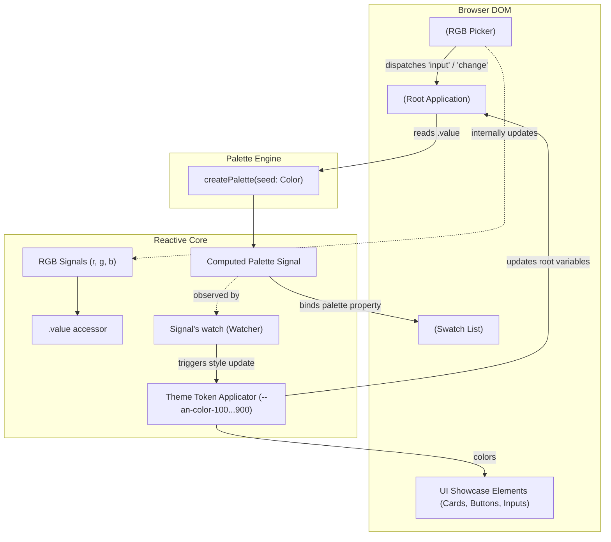

# Anima 0.1: Interactive Demo & Component Architecture Design

## 1. Overview & Problem Statement

### 1.1 Context & Background

Anima is a color palette generation library designed around perceptually uniform color spaces. Built on top of `gs-tools/export/color`, Anima uses the OKLCH cylindrical color space (Lightness \(L\), Chroma \(C\), Hue \(H\)) to generate a harmonious 9-shade palette (`c100` to `c900`) from an initial seed color.

The color generation algorithm works by:

1. Converting a seed color to OKLCH.
2. Generating 9 fixed lightness targets ranging from `0.96` (`c100`) down to `0.20` (`c900`) in uniform increments (`0.095`).
3. For each target lightness, sampling the sRGB gamut boundary radially along the chroma axis:
   - If \((L, \text{seedChroma}, H)\) is inside the sRGB gamut, preserving the seed chroma.
   - If \((L, \text{seedChroma}, H)\) falls outside the sRGB gamut, performing a binary search radially inwards (decreasing chroma towards 0) to find the maximum in-gamut chroma.
4. Converting each resulting shade back to the requested color space.

### 1.2 Problem Statement

Currently, Anima only validates palette output via Playwright test runners capturing static screenshots in headless/test environments. There is no interactive user-facing visualizer or documentation demo where users can:

- Understand what Anima is and how its radial chroma gamut sampling works.
- Interactively choose a seed color using an intuitive RGB color picker.
- Inspect the resulting 9-shade palette in real time.
- Visually evaluate the palette applied directly to real user interface components.

### 1.3 Design Goals

- **Interactive RGB Color Picker (`<an-color-picker>`)**: An autonomous Web Component built with Lit and `@lit-labs/signals` featuring Red, Green, and Blue sliders (0–255), synced numeric inputs, Hex input with live parsing and blur validation, and a live preview swatch.
- **Form-like API**: The picker functions like an `<input>` element with a `.value` property accepting any `Color` (automatically converted to `RgbColor`), defaulting to `rgb(0, 0, 0)`, and dispatching standard `'input'` and `'change'` events.
- **Palette Preview (`<an-palette-preview>`)**: A dedicated Web Component displaying 9 swatches (`c100` through `c900`). If `palette` is `null` (the default), it renders nothing (no DOM nodes). Each swatch displays only its hex value, and only on hover.
- **Self-Theming Demo Page (`<an-demo>`)**: A single-page application hosted on GitHub Pages that provides an educational introduction to Anima's color mathematics. Setting the palette dynamically updates root CSS custom properties (`--an-color-100` through `--an-color-900`) via Signal's `watch`, making the demo page itself a live preview of the active palette.
- **Color-Only Styling Constraint**: Ensure the demo page and components do not use any styling other than colours (no decorative drop shadows, box borders with heavy rounding, or gradient treatments). Applying the dynamic colour tokens is isolated as a dedicated phase.
- **Ecosystem Consistency**: Use Rollup with an inline `litCssPlugin` to compile SASS (`.scss`) directly into Lit component styles, mirroring the architecture of `protoboard3`.

### 1.4 Non-Goals

- Full multi-palette harmony generation (complementary, split-complementary, triadic) in 0.1.
- One-click clipboard copy buttons on palette swatches.
- Non-color decorative styling (box shadows, gradients, skeuomorphic styling).
- External UI component library dependencies (all components are built from scratch).

---

## 2. Architecture & Reactive Data Flow

### 2.1 System Architecture Diagram



### 2.2 Component Roles & Interactions

1. **`<an-color-picker>` (`src/demo/component/rgb-picker/rgb-picker.ts`)**:
   - Manages local RGB state using individual `r`, `g`, and `b` signals.
   - Computes hex representation and preview swatch color reactively.
   - Computes `isHexValid` from user-entered raw hex text.
   - Dispatches `'input'` events during active user manipulation (slider drag, text typing) and `'change'` events on committed adjustments (slider release, input blur).
   - Exposes public getter and setter for `value: Color`.

2. **`<an-palette-preview>` (`src/demo/component/palette-preview/palette-preview.ts`)**:
   - Accepts a `palette: Palette | null` property defaulting to `null`.
   - If `palette` is `null`, renders nothing (no DOM nodes).
   - When `palette` is provided, renders 9 swatches corresponding to `c100` through `c900`.
   - Swatches display only the hex value, and only on hover.

3. **`<an-demo>` (`src/demo/demo.ts`)**:
   - Root application component embedding the educational explanation, `<an-color-picker>`, `<an-palette-preview>`, and UI showcase components.
   - Listens to `'input'` and `'change'` events from `<an-color-picker>`.
   - Uses Signal's `watch` on the computed `palette` signal to update root CSS custom properties (`--an-color-100` through `--an-color-900`) on `document.documentElement`.
   - Styles itself and its child components using strictly colors mapped to `--an-color-*` (no styling other than colours). A subsequent dedicated step applies the colour tokens.

---

## 3. Theming & Token Mapping Schema

The demo page injects CSS custom properties at the document root, which are then consumed by semantic page tokens. All styling is strictly limited to colours:

| CSS Custom Property | Source Palette Shade | Target Semantic Token Usage                        |
| :------------------ | :------------------- | :------------------------------------------------- |
| `--an-color-100`    | `palette.c100`       | Page background, container fill                    |
| `--an-color-200`    | `palette.c200`       | Card surface background, code block background     |
| `--an-color-300`    | `palette.c300`       | Subtle divider lines                               |
| `--an-color-400`    | `palette.c400`       | Focus outlines, disabled button backgrounds        |
| `--an-color-500`    | `palette.c500`       | Accent elements, badges, interactive slider thumbs |
| `--an-color-600`    | `palette.c600`       | Primary interactive buttons, links                 |
| `--an-color-700`    | `palette.c700`       | Button hover states, secondary text                |
| `--an-color-800`    | `palette.c800`       | Strong headings, active interactive states         |
| `--an-color-900`    | `palette.c900`       | Primary body text                                  |

---

## 4. Typesafe Interfaces (Interface-Only Specification)

> [!NOTE]
> In accordance with project architecture standards, this section strictly specifies TypeScript interfaces, class signatures, property types, and method signatures without implementation bodies.

### 4.1 Channel Type

```typescript
export type RgbChannel = 'r' | 'g' | 'b';
```

### 4.2 `<an-color-picker>` Interface

```typescript
import {Signal} from '@lit-labs/signals';
import {Color, RgbColor} from 'gs-tools/export/color';
import {LitElement} from 'lit';

export type RgbChannel = 'r' | 'g' | 'b';

/**
 * Autonomous RGB color picker component with slider and hex controls.
 * Custom Element Tag: <an-color-picker>
 */
export declare class RgbPicker extends LitElement {
  /**
   * Internal reactive signal for the red channel (0–255).
   */
  protected readonly r: Signal.State<number>;

  /**
   * Internal reactive signal for the green channel (0–255).
   */
  protected readonly g: Signal.State<number>;

  /**
   * Internal reactive signal for the blue channel (0–255).
   */
  protected readonly b: Signal.State<number>;

  /**
   * Computed signal yielding the current RgbColor representation.
   */
  protected readonly rgbColor: Signal.Computed<RgbColor>;

  /**
   * Computed signal yielding the formatted hex string (#rrggbb).
   */
  protected readonly hex: Signal.Computed<string>;

  /**
   * State signal tracking the current raw string typed into the hex input.
   */
  protected readonly rawHex: Signal.State<string>;

  /**
   * Computed signal evaluating whether rawHex represents a valid 3- or 6-digit hex code.
   */
  protected readonly isHexValid: Signal.Computed<boolean>;

  /**
   * Current color value.
   * - Setting value accepts any Color and converts it to RgbColor via convert(val, 'rgb').
   * - Getting value returns the current RgbColor.
   */
  get value(): Color;
  set value(color: Color);

  /**
   * Dispatches a standard DOM Event of type 'input'.
   */
  protected dispatchInputEvent(): void;

  /**
   * Dispatches a standard DOM Event of type 'change'.
   */
  protected dispatchChangeEvent(): void;

  /**
   * Handles user interaction on R, G, or B range sliders.
   */
  protected handleSliderInput(channel: RgbChannel, event: Event): void;

  /**
   * Handles commit event on range sliders.
   */
  protected handleSliderChange(channel: RgbChannel, event: Event): void;

  /**
   * Handles user interaction on R, G, or B numeric input boxes.
   */
  protected handleNumericInput(channel: RgbChannel, event: Event): void;

  /**
   * Handles user input into the Hex text input box.
   */
  protected handleHexInput(event: Event): void;

  /**
   * Handles blur on the Hex text input box, validating or resetting the field.
   */
  protected handleHexBlur(event: Event): void;
}
```

### 4.3 `<an-palette-preview>` Interface

```typescript
import {LitElement} from 'lit';
import {Palette} from '../../../palette/palette';

/**
 * Component rendering the 9-shade swatch preview.
 * - Renders no DOM nodes when palette is null.
 * - Displays only the hex value on each swatch, visible only on hover.
 * Custom Element Tag: <an-palette-preview>
 */
export declare class PalettePreview extends LitElement {
  /**
   * The palette object containing shades c100 through c900, or null if unset.
   * Defaults to null.
   */
  palette: Palette | null;
}
```

### 4.4 `<an-demo>` Root Application Interface

```typescript
import {Signal} from '@lit-labs/signals';
import {Color} from 'gs-tools/export/color';
import {LitElement} from 'lit';
import {Palette} from '../palette/palette';

/**
 * Root demo application coordinating the introduction, picker, preview, and theme tokens.
 * Uses Signal's watch to reactively update root CSS custom properties.
 * Custom Element Tag: <an-demo>
 */
export declare class AnimaDemo extends LitElement {
  /**
   * Reactive signal holding the current active seed color.
   */
  protected readonly seedColor: Signal.State<Color>;

  /**
   * Computed signal producing the 9-shade Palette from seedColor.
   */
  protected readonly palette: Signal.Computed<Palette>;

  /**
   * Handles 'input' and 'change' events from the child <an-color-picker>.
   */
  protected handleColorPickerEvent(event: Event): void;
}
```

### 4.5 Build & SASS Compilation Contract

The Rollup configuration (`rollup.config.mjs`) exports a configuration object that includes an inline `litCssPlugin`:

```typescript
import {Plugin} from 'rollup';

export interface LitCssPluginOptions {
  readonly loadPaths?: readonly string[];
}

export declare function litCssPlugin(options?: LitCssPluginOptions): Plugin;
```

---

## 5. Verification & Testing Strategy

### 5.1 Playwright Unit & Reactive Tests

- **`src/demo/component/rgb-picker/rgb-picker.test.ts`**:
  - Verify setting `.value = oklch(...)` converts to RGB and updates slider and hex positions.
  - Verify dragging sliders dispatches `'input'` events immediately with updated `.value`.
  - Verify releasing sliders dispatches `'change'` events.
  - Verify typing valid 3-character hex (e.g. `f00`) and 6-character hex (`#00ff00`) updates RGB signals.
  - Verify typing malformed hex marks field invalid on blur without updating RGB signals.
  - Visual regression screenshot test for `<an-color-picker>`.
- **`src/demo/component/palette-preview/palette-preview.test.ts`**:
  - Verify rendering no DOM nodes when `palette` is `null`.
  - Verify rendering 9 swatches matching `c100`–`c900` when `palette` is provided.
  - Verify the hex value is displayed only on hover.
  - Visual regression screenshot test for `<an-palette-preview>`.
- **`src/demo/demo.test.ts`**:
  - Verify page loads with introduction and algorithmic explanation.
  - Verify adjusting picker updates `<an-palette-preview>` and `--an-color-*` root CSS variables via Signal's watch.
  - Visual regression screenshot test for the entire demo page.
