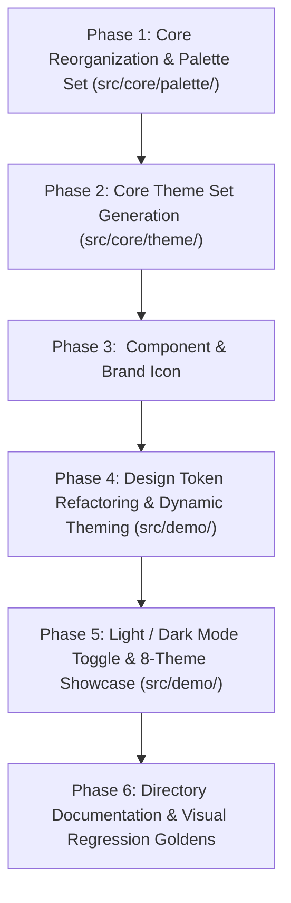

# Anima 0.2 Implementation Roadmap & Specifications

Based on the architectural specifications defined in [`docs/0.2.md`](./0.2.md), this document details the phased implementation roadmap for Anima 0.2 core library restructuring, palette set expansion, theme set generation, the `<an-theme-preview>` Web Component, refactored design token CSS custom properties without `palette`/`theme` keywords, the Anima brand icon, and interactive light/dark mode switching on the demo application.

---

## 1. Dependency Graph

---

## 2. Phased Implementation Plan

### Phase 1: Core Reorganization & Palette Set (`src/core/palette/`)

**Goal**: Relocate existing palette generation from `src/palette/` to `src/core/palette/` with strict one-type-per-file modularity, update all imports across the repository, and implement `createPaletteSet` generating the 5-palette set (`highlight`, `neutral`, `error`, `warning`, `success`).  
**Dependencies**: None.

- [x] **1. Phase 1: Core Reorganization & Palette Set**
  - [x] **1.1 Directory Structure & File Migration**
    - [x] 1.1.1 Move `src/palette/palette.ts` to `src/core/palette/palette.ts` (defining only `export interface Palette`).
    - [x] 1.1.2 Move `src/palette/create-palette.ts` to `src/core/palette/create-palette.ts` (exporting only `createPalette(seedColor: Color): Palette`).
    - [x] 1.1.3 Move `src/palette/create-palette.test.ts` to `src/core/palette/create-palette.test.ts`.
    - [x] 1.1.4 Update imports across `src/demo/` and tests to reference `../core/palette/`.
    - [x] 1.1.5 Update [`src/index.ts`](../src/index.ts) to export from `./core/palette/palette` and `./core/palette/create-palette`.
  - [x] **1.2 Palette Set Types & Implementation (`palette-set.ts`, `create-palette-set.ts`)**
    - [x] 1.2.1 Create `src/core/palette/palette-set.ts` defining only `export interface PaletteSet`.
    - [x] 1.2.2 Create `src/core/palette/create-palette-set.ts` implementing only `createPaletteSet(seedColor: Color): PaletteSet`:
      - Generate `highlight` from `seedColor`.
      - Generate `neutral` by converting `seedColor` to HSL, setting saturation to 0.1 (`s: 0.1`), and passing back to `createPalette`.
      - Generate `error` from `#dc2626` (`rgb(220, 38, 38)`).
      - Generate `warning` from `#d97706` (`rgb(217, 119, 6)`).
      - Generate `success` from `#16a34a` (`rgb(22, 163, 74)`).
    - [x] 1.2.3 Export `PaletteSet` and `createPaletteSet` from [`src/index.ts`](../src/index.ts).
  - [x] **1.3 Unit Testing (`src/core/palette/create-palette-set.test.ts`)**
    - [x] 1.3.1 Verify `createPaletteSet` returns all 5 palettes with shades `c100` through `c900`.
    - [x] 1.3.2 Verify neutral palette saturation is substantially lower than highlight palette saturation.
    - [x] 1.3.3 Verify semantic palettes (error, warning, success) produce expected color ranges.
  - [x] **1.4 Directory Documentation (`src/core/palette/README.md`)**
    - [x] 1.4.1 Document `palette.ts`, `create-palette.ts`, `palette-set.ts`, and `create-palette-set.ts`.

---

### Phase 2: Core Theme Set Generation (`src/core/theme/`)

**Goal**: Implement `createThemeSet(seedColor: Color): ThemeSet` across dedicated modular files defining the 8 themes (Light 0–3, Dark 0–3) with role mappings for `background`, `primary`, `secondary`, `display`, `error`, `warning`, and `success`.  
**Dependencies**: Phase 1.

- [x] **2. Phase 2: Core Theme Set Generation**
  - [x] **2.1 Theme Data Models & Typedefs (`theme.ts`, `theme-set.ts`)**
    - [x] 2.1.1 Create `src/core/theme/theme.ts` defining `ThemeMode`, `ThemeType`, `ThemeSection`, and `export interface Theme`.
    - [x] 2.1.2 Create `src/core/theme/theme-set.ts` defining only `export interface ThemeSet`.
  - [x] **2.2 Theme Set Factory (`src/core/theme/create-theme-set.ts`)**
    - [x] 2.2.1 Create `src/core/theme/create-theme-set.ts` implementing `createThemeSet(seedColor: Color): ThemeSet` calling `createPaletteSet(seedColor)`.
    - [x] 2.2.2 Implement Light Theme 0–3 shade mappings including status colors per the specification table.
    - [x] 2.2.3 Implement Dark Theme 0–3 shade mappings including status colors per the specification table.
    - [x] 2.2.4 Export `Theme`, `ThemeSet`, `ThemeMode`, `ThemeType`, `ThemeSection`, and `createThemeSet` from [`src/index.ts`](../src/index.ts).
  - [x] **2.3 Unit Testing (`src/core/theme/create-theme-set.test.ts`)**
    - [x] 2.3.1 Verify `createThemeSet` returns valid Light 0–3 and Dark 0–3 themes.
    - [x] 2.3.2 Verify all roles (`background`, `primary`, `secondary`, `display`, `error`, `warning`, `success`) adhere to the defined shade mappings for each theme index.
    - [x] 2.3.3 Verify WCAG contrast ratios between foreground texts and background satisfy design guidelines.
  - [x] **2.4 Directory Documentation (`src/core/theme/README.md`, `src/core/README.md`)**
    - [x] 2.4.1 Document `theme.ts`, `theme-set.ts`, and `create-theme-set.ts` in `src/core/theme/README.md`.
    - [x] 2.4.2 Create `src/core/README.md` documenting subdirectories `palette/` and `theme/`.

---

### Phase 3: `<an-theme-preview>` Component & Brand Icon (`src/demo/component/theme-preview/`)

**Goal**: Implement the official Anima SVG brand icon and the autonomous `<an-theme-preview>` Web Component rendering a single theme inside a card surface with background colour, brand icon, primary text, secondary text, success text, warning text, and error text.  
**Dependencies**: Phase 2.

- [x] **3. Phase 3: <an-theme-preview> Component & Brand Icon**
  - [x] **3.1 Anima Brand SVG Icon (`src/demo/assets/anima-icon.svg`, `src/demo/favicon.svg`)**
    - [x] 3.1.1 Create `src/demo/assets/anima-icon.svg` implementing the stylized harmonic color prism bloom icon.
    - [x] 3.1.2 Create `src/demo/favicon.svg` and link as favicon in `src/demo/index.html`.
  - [x] **3.2 Component Styling (`src/demo/component/theme-preview/theme-preview.scss`)**
    - [x] 3.2.1 Define card container color-only layout (fill from `theme.background`, no drop shadows or rounded corners).
    - [x] 3.2.2 Define typography styles for primary text, secondary text, and status lines (success, warning, error).
    - [x] 3.2.3 Define display/icon styling using `theme.display`.
  - [x] **3.3 Component Implementation (`src/demo/component/theme-preview/theme-preview.ts`)**
    - [x] 3.3.1 Extend `LitElement` with `@property({attribute: false}) theme: Theme | null = null` and `@property() label: string = ''`.
    - [x] 3.3.2 Return no DOM nodes when `theme` is `null`.
    - [x] 3.3.3 Render card container filled with `theme.background`.
    - [x] 3.3.4 Render Anima brand icon in `theme.display`.
    - [x] 3.3.5 Render primary heading in `theme.primary` and secondary caption in `theme.secondary`.
    - [x] 3.3.6 Render status texts for `theme.success`, `theme.warning`, and `theme.error`.
    - [x] 3.3.7 Register custom element as `an-theme-preview`.
  - [x] **3.4 Unit & Visual Testing (`src/demo/component/theme-preview/theme-preview.test.ts`)**
    - [x] 3.4.1 Test component renders no DOM nodes when `theme` is `null`.
    - [x] 3.4.2 Test component renders background, icon, primary, secondary, success, warning, and error text lines when `theme` is provided.
    - [x] 3.4.3 Capture visual screenshot golden for `<an-theme-preview>`.
  - [x] **3.5 Directory Documentation (`src/demo/component/theme-preview/README.md`)**
    - [x] 3.5.1 Document `theme-preview.ts` and `theme-preview.scss`.

---

### Phase 4: Design Token Refactoring & Dynamic Theming (`src/demo/`)

**Goal**: Refactor CSS custom properties generated in `<an-demo>` to adhere to the cleaned design token naming convention (`--an-[palette_type]-[shade]` and `--an-main-[mode]_[type]-[section]`), and update `demo.scss` to style the demo using the new tokens.  
**Dependencies**: Phase 3.

- [x] **4. Phase 4: Design Token Refactoring & Dynamic Theming**
  - [x] **4.1 Reactive Theme Set & Watcher (`src/demo/demo.ts`)**
    - [x] 4.1.1 Replace single palette computed signal with `themeSet: Signal.Computed<ThemeSet> = new Signal.Computed(() => createThemeSet(this.seedColor.get()))`.
    - [x] 4.1.2 Update `applyThemeTokens()` to emit without `palette`/`theme` keywords:
      - All 5 palettes: `--an-main_highlight-*`, `--an-main_neutral-*`, `--an-error-*`, `--an-warning-*`, `--an-success-*`.
      - All 8 themes: `--an-main-[mode]_[type]-[section]` for `mode` in `light`/`dark`, `type` in `0`..`3`, `section` in `background`/`primary`/`secondary`/`display`/`error`/`warning`/`success`.
    - [x] 4.1.3 Update `initWatcher()` to observe `this.themeSet` instead of single `this.palette`.
  - [x] **4.2 Demo Scoped Styling (`src/demo/demo.scss`)**
    - [x] 4.2.1 Update `:host` and `:host([color-scheme="dark"])` to bind root page surface to Theme 1 (`background`, `primary`).
    - [x] 4.2.2 Bind `.generator-layout`, code blocks, and recessed containers to Theme 0 (`background`, `primary`, `secondary`).
    - [x] 4.2.3 Bind interactive buttons, links, and accents to Theme 2 / Theme 3.
    - [x] 4.2.4 Remove legacy `--an-color-100` through `--an-color-900` references.

---

### Phase 5: Light / Dark Mode Toggle, Palette Previews & 8 Theme Previews (`src/demo/`)

**Goal**: Add the segmented mode toggle button (`Light` | `Dark`) above the first `h1` in normal document flow, render all 5 palettes in the generator view, and render all 8 `<an-theme-preview>` cards (Light 0–3 and Dark 0–3) in a dedicated theme showcase grid.  
**Dependencies**: Phase 4.

- [x] **5. Phase 5: Light / Dark Mode Toggle, Palette Previews & 8 Theme Previews**
  - [x] **5.1 Reactive Mode State & Toggle Component (`src/demo/demo.ts`, `src/demo/demo.scss`)**
    - [x] 5.1.1 Add `mode: Signal.State<ThemeMode> = new Signal.State<ThemeMode>('light')`.
    - [x] 5.1.2 Add `handleModeSelect(selectedMode: ThemeMode): void` method updating `this.mode` and switching `color-scheme`.
    - [x] 5.1.3 Render segmented two-button group (`Light` | `Dark`) above the first `h1`, right-aligned in document flow.
    - [x] 5.1.4 Style segmented toggle buttons using color-only rules with the active mode highlighted.
  - [x] **5.2 5-Palette Generator Preview (`src/demo/demo.ts`, `src/demo/demo.scss`)**
    - [x] 5.2.1 Update generator section in `demo.ts` to render 5 `<an-palette-preview>` instances:
      - Highlight Palette (`themeSet.palettes.highlight`)
      - Neutral Palette (`themeSet.palettes.neutral`)
      - Error Palette (`themeSet.palettes.error`)
      - Warning Palette (`themeSet.palettes.warning`)
      - Success Palette (`themeSet.palettes.success`)
    - [x] 5.2.2 Add clear subheadings and descriptions for each palette within the generator section.
  - [x] **5.3 8-Theme Showcase Grid (`src/demo/demo.ts`, `src/demo/demo.scss`)**
    - [x] 5.3.1 Create a dedicated Themes showcase section rendering 8 `<an-theme-preview>` cards:
      - Light Mode: Theme 0, Theme 1, Theme 2, Theme 3
      - Dark Mode: Theme 0, Theme 1, Theme 2, Theme 3
    - [x] 5.3.2 Pass corresponding `theme` and `label` to each `<an-theme-preview>` instance.
    - [x] 5.3.3 Style the theme showcase grid with responsive flex/grid color-only styling.

---

### Phase 6: Directory Documentation & Visual Regression Goldens

**Goal**: Update all affected directory `README.md` files, update integration tests, and capture visual regression screenshot goldens for both Light and Dark modes.  
**Dependencies**: Phase 5.

- [x] **6. Phase 6: Directory Documentation & Visual Regression Goldens**
  - [x] **6.1 Directory Documentation Updates**
    - [x] 6.1.1 Update `src/README.md` to reflect `core/` and `demo/` subdirectories.
    - [x] 6.1.2 Update `src/demo/README.md` to document the updated `demo.ts` and `demo.scss` contracts.
    - [x] 6.1.3 Update `src/demo/component/README.md` to document `theme-preview/`.
    - [x] 6.1.4 Update root [`README.md`](../README.md) if necessary.
  - [x] **6.2 Visual Regression Goldens & Integration Testing (`src/demo/demo.test.ts`)**
    - [x] 6.2.1 Capture golden screenshot for `<an-demo>` in Light Mode (`demo.png`) covering 5 palettes and 8 themes.
    - [x] 6.2.2 Capture golden screenshot for `<an-demo>` after interactive seed color change (`demo-updated.png`).
    - [x] 6.2.3 Capture golden screenshot for `<an-demo>` in Dark Mode (`demo-dark.png`) toggled via segmented mode button.
