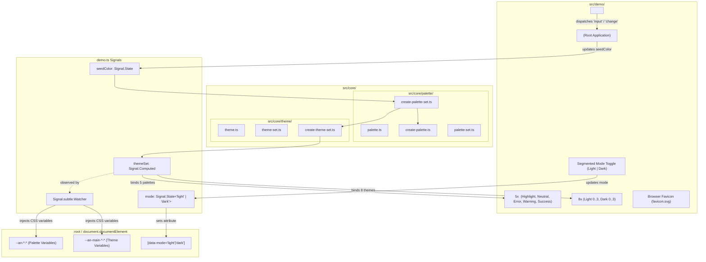

# Anima 0.2: Theme Set Architecture, Dynamic Theming & Light/Dark Mode Design

## 1. Overview & Problem Statement

### 1.1 Context & Background

Anima 0.1 established the foundations of perceptual color palette generation using the OKLCH color space and radial chroma gamut boundary sampling. It delivered:
- The core `createPalette` function generating a 9-shade palette (`c100`–`c900`) from any seed color.
- Interactive Web Components (`<an-color-picker>` and `<an-palette-preview>`).
- A demo page (`<an-demo>`) hosted on GitHub Pages demonstrating palette generation with dynamic CSS custom properties.

However, Anima 0.1 only supports generating a single palette from a single seed color. A complete design system requires an entire **theme set** composed of multiple complementary palettes (highlight, neutral, semantic error/warning/success) that systematically map into coherent, accessible user interface themes for both light and dark display modes.

### 1.2 Problem Statement

In Anima 0.1:
1. **Single Palette Limitation**: Only one highlight palette is generated from the seed color. Neutral backgrounds and status palettes (error, warning, success) must be constructed manually or are missing entirely.
2. **Lack of Themes**: There is no concept of a `Theme` (surface colors defining `background`, `primary`, `secondary`, `display`, and accessible status text colors) or `ThemeSet` (Light 0–3 and Dark 0–3) in the core library.
3. **Flat Token Naming**: The CSS custom properties emitted by `<an-demo>` (`--an-color-100` through `--an-color-900`) do not conform to the multi-tier design token specification outlined in the design documentation.
4. **No Light/Dark Mode Switching**: The demo page only renders in a single static presentation, with no ability for users to toggle between light mode and dark mode to evaluate how their seed color adapts to different display environments.
5. **No Theme Preview**: Users cannot inspect how an individual theme renders its typography, icons, and status indicators in context against its assigned background color.
6. **Code Architecture Organization**: Core palette generation functions reside under `src/palette/` rather than a centralized, reusable core library structure (`src/core/`) with strict one-type-per-file modularity.

### 1.3 Design Goals

- **Core Library Reorganization & Strict Modularity (`src/core/`)**: Move reusable library functionality into dedicated, isolated files under `src/core/`:
  - `src/core/palette/palette.ts`: `Palette` interface.
  - `src/core/palette/create-palette.ts`: `createPalette` factory function.
  - `src/core/palette/palette-set.ts`: `PaletteSet` interface.
  - `src/core/palette/create-palette-set.ts`: `createPaletteSet` factory function.
  - `src/core/theme/theme.ts`: `Theme` interface, `ThemeMode`, `ThemeType`, and `ThemeSection` typedefs.
  - `src/core/theme/theme-set.ts`: `ThemeSet` interface.
  - `src/core/theme/create-theme-set.ts`: `createThemeSet` factory function.
  - Re-export all public contracts cleanly via [`src/index.ts`](../src/index.ts).
- **Palette Set Expansion (`PaletteSet`)**:
  - `highlight`: Directly generated from the user's seed color.
  - `neutral`: Generated by reducing the seed color's saturation by 75% in HSL color space (`s * 0.25`), maintaining hue cohesion while providing muted background and text options.
  - `error`: Fixed semantic palette generated from standard red seed `#dc2626`.
  - `warning`: Fixed semantic palette generated from standard amber seed `#d97706`.
  - `success`: Fixed semantic palette generated from standard green seed `#16a34a`.
- **Theme Set Generation (`ThemeSet`)**:
  - Implement `createThemeSet(seed: Color): ThemeSet` returning 8 distinct themes: Light 0–3 and Dark 0–3.
  - Each theme defines 7 semantic roles: `background`, `primary` (high contrast text), `secondary` (dimmer text, WCAG contrast $\ge 4.5:1$), `display` (decorative/icon foreground, WCAG contrast $\ge 3.0:1$), `success` (positive status text), `warning` (cautionary status text), and `error` (failure status text).
  - Theme roles:
    - **Theme 0 (Darker / Recessed)**: Uses a neutral shade for the background (e.g. card wells, code containers).
    - **Theme 1 (Normal)**: Default page surface with near-white / near-black background.
    - **Theme 2 (Highlight)**: High-saturation highlight shade for background (e.g. prominent callouts, banners).
    - **Theme 3 (Super Highlight)**: Middle highlight shade for background, intended for maximum user attention.
- **Anima Brand Icon**:
  - A stylized SVG icon representing Anima (a harmonic color prism / aperture bloom evoking light and perceptual balance).
  - Rendered inside `<an-theme-preview>` as the display icon (styled with the theme's `display` color).
  - Rendered as the browser tab favicon for the demo application (`src/demo/favicon.svg`).
- **Theme Preview Component (`<an-theme-preview>`)**:
  - An autonomous Web Component displaying a single theme inside a card surface.
  - Visualizes:
    - Card container filled with the theme's `background` color.
    - Anima brand icon styled with the `display` color.
    - Primary text styled with the `primary` color.
    - Secondary text styled with the `secondary` color.
    - Status text lines styled with `success`, `warning`, and `error` colors.
  - The demo page renders all 8 theme previews (Light 0–3 and Dark 0–3) in a dedicated theme showcase grid.
- **Design Token CSS Variable Refactoring**:
  - Emitted directly by `<an-demo>` to `document.documentElement.style`.
  - Formatted following the design token hierarchy with `an-` prefix, omitting redundant `palette` and `theme` keywords:
    - Palette tokens: `--an-[palette_type]-[shade]` (e.g. `--an-main_highlight-100`, `--an-main_neutral-500`, `--an-error-600`).
    - Color theme tokens: `--an-main-[mode]_[type]-[section]` (e.g. `--an-main-light_1-background`, `--an-main-dark_0-primary`, `--an-main-light_2-error`).
- **Interactive Light / Dark Mode Toggle**:
  - A segmented two-button group (`Light` | `Dark`) placed above the first `h1`, right-aligned in document flow (not floating).
  - Toggles `<an-demo>` and page surfaces between light and dark modes reactively.
- **Enhanced Palette Visualizer**:
  - The Colour Generator section renders 5 `<an-palette-preview>` rows displaying the Highlight, Neutral, Error, Warning, and Success palettes with clear headings.
- **Color-Only Styling Constraint**:
  - Maintain the rule that styling is strictly limited to colours (no drop shadows, rounded container treatments, or gradient decorations).

### 1.4 Non-Goals

- Component tokens (`--an-component-*`); deferred to a subsequent phase.
- Customizable seed colors for semantic palettes (Error, Warning, Success remain fixed constants).
- Harmony generators (complementary, triadic, analogous) outside of the seed + neutral + status palette set.

---

## 2. Architecture & Reactive Data Flow

### 2.1 System Architecture Diagram



### 2.2 Component & Module Roles

1. **`src/core/palette/`**:
   - `palette.ts`: Defines `export interface Palette` with shades `c100` through `c900`.
   - `create-palette.ts`: Exports `createPalette(seedColor: Color): Palette` implementing radial gamut sampling.
   - `palette-set.ts`: Defines `export interface PaletteSet` with `highlight`, `neutral`, `error`, `warning`, `success`.
   - `create-palette-set.ts`: Exports `createPaletteSet(seedColor: Color): PaletteSet`:
     - `highlight`: `createPalette(seedColor)`
     - `neutral`: `createPalette(oklch(...))` derived by reducing seed saturation by 75% in HSL.
     - `error`: `createPalette(rgb(220, 38, 38))`
     - `warning`: `createPalette(rgb(217, 119, 6))`
     - `success`: `createPalette(rgb(22, 163, 74))`
2. **`src/core/theme/`**:
   - `theme.ts`: Defines `ThemeMode`, `ThemeType`, `ThemeSection`, and `export interface Theme` (`background`, `primary`, `secondary`, `display`, `error`, `warning`, `success`).
   - `theme-set.ts`: Defines `export interface ThemeSet` (`palettes: PaletteSet`, `light: Record<ThemeType, Theme>`, `dark: Record<ThemeType, Theme>`).
   - `create-theme-set.ts`: Exports `createThemeSet(seedColor: Color): ThemeSet`, constructing the 8 themes (Light 0–3, Dark 0–3) from `createPaletteSet(seedColor)`.
3. **`<an-theme-preview>` (`src/demo/component/theme-preview/theme-preview.ts`)**:
   - Autonomous Web Component accepting a single `theme: Theme | null` and `label: string`.
   - Renders a card container styled with `theme.background`.
   - Renders the Anima brand icon in `theme.display`.
   - Renders headline text in `theme.primary`.
   - Renders subtext in `theme.secondary`.
   - Renders status indicators in `theme.success`, `theme.warning`, and `theme.error`.
   - Renders nothing (no DOM nodes) if `theme` is `null`.
4. **`src/demo/demo.ts`**:
   - Manages `seedColor` (`Signal.State<Color>`) and `mode` (`Signal.State<'light' | 'dark'>`).
   - Computes `themeSet` reactively via `Signal.Computed`.
   - Hosts `Signal.subtle.Watcher` that automatically formats and injects all `--an-[palette_type]-[shade]` and `--an-main-[mode]_[type]-[section]` variables onto `document.documentElement.style`.
   - Renders the segmented mode toggle above the first `h1`.
   - Renders 5 `<an-palette-preview>` instances within the generator section.
   - Renders 8 `<an-theme-preview>` instances in the theme showcase grid.
5. **`src/demo/demo.scss`**:
   - Consumes `--an-main-light_*` and `--an-main-dark_*` based on the `:host([data-mode="dark"])` state.
   - Binds the root container to Theme 1 (`background`, `primary`), generator and code blocks to Theme 0, and interactive buttons to Theme 2 / Theme 3.

---

## 3. Theming, Shade Mappings & Token Schema

### 3.1 Initial Theme Shade Assignment Table

Following the definitions in [`src/demo/demo.ts`](../src/demo/demo.ts), the initial shade mappings for each theme are defined as:

| Mode | Theme Index | Theme Concept | `background` | `primary` | `secondary` | `display` | `error` | `warning` | `success` |
| :--- | :--- | :--- | :--- | :--- | :--- | :--- | :--- | :--- | :--- |
| **Light** | **0** | Darker / Recessed surface | `neutral.c200` | `neutral.c900` | `neutral.c700` | `neutral.c600` | `error.c800` | `warning.c800` | `success.c800` |
| **Light** | **1** | Normal page surface | `neutral.c100` | `neutral.c900` | `neutral.c700` | `neutral.c600` | `error.c800` | `warning.c800` | `success.c800` |
| **Light** | **2** | Highlight surface | `highlight.c100` | `highlight.c900` | `highlight.c700` | `highlight.c600` | `error.c800` | `warning.c800` | `success.c800` |
| **Light** | **3** | Super highlight surface | `highlight.c500` | `highlight.c100` | `highlight.c200` | `highlight.c100` | `error.c100` | `warning.c100` | `success.c100` |
| **Dark** | **0** | Darker / Recessed surface | `neutral.c900` | `neutral.c100` | `neutral.c300` | `neutral.c400` | `error.c300` | `warning.c300` | `success.c300` |
| **Dark** | **1** | Normal page surface | `neutral.c800` | `neutral.c100` | `neutral.c300` | `neutral.c400` | `error.c300` | `warning.c300` | `success.c300` |
| **Dark** | **2** | Highlight surface | `highlight.c900` | `highlight.c100` | `highlight.c300` | `highlight.c400` | `error.c300` | `warning.c300` | `success.c300` |
| **Dark** | **3** | Super highlight surface | `highlight.c500` | `highlight.c900` | `highlight.c800` | `highlight.c900` | `error.c900` | `warning.c900` | `success.c900` |

### 3.2 Refactored Design Token CSS Variables

CSS variables emitted on `document.documentElement.style` without `palette` and `theme` keywords:

#### Palette Tokens: `--an-[palette_type]-[shade]`
- Highlight: `--an-main_highlight-100` through `--an-main_highlight-900`
- Neutral: `--an-main_neutral-100` through `--an-main_neutral-900`
- Error: `--an-error-100` through `--an-error-900`
- Warning: `--an-warning-100` through `--an-warning-900`
- Success: `--an-success-100` through `--an-success-900`

#### Color Theme Tokens: `--an-main-[mode]_[type]-[section]`
Where:
- `seed_name`: `main`
- `mode`: `light` or `dark`
- `type`: `0`, `1`, `2`, `3`
- `section`: `background`, `primary`, `secondary`, `display`, `error`, `warning`, `success`

Examples:
- `--an-main-light_0-background`
- `--an-main-light_1-primary`
- `--an-main-light_2-error`
- `--an-main-dark_2-secondary`
- `--an-main-dark_3-display`
- `--an-main-dark_1-success`

---

## 4. Typesafe Interfaces (Interface-Only Specification)

> [!NOTE]
> In accordance with project architecture standards, each interface and function is declared in its own dedicated file under `src/core/` without implementation bodies.

### 4.1 Palette Module Interfaces (`src/core/palette/`)

#### [`src/core/palette/palette.ts`](../src/core/palette/palette.ts)
```typescript
import {Color} from 'gs-tools/export/color';

export interface Palette {
  readonly c100: Color;
  readonly c200: Color;
  readonly c300: Color;
  readonly c400: Color;
  readonly c500: Color;
  readonly c600: Color;
  readonly c700: Color;
  readonly c800: Color;
  readonly c900: Color;
}
```

#### [`src/core/palette/create-palette.ts`](../src/core/palette/create-palette.ts)
```typescript
import {Color} from 'gs-tools/export/color';
import {Palette} from './palette';

export declare function createPalette(seedColor: Color): Palette;
```

#### [`src/core/palette/palette-set.ts`](../src/core/palette/palette-set.ts)
```typescript
import {Palette} from './palette';

export interface PaletteSet {
  readonly highlight: Palette;
  readonly neutral: Palette;
  readonly error: Palette;
  readonly warning: Palette;
  readonly success: Palette;
}
```

#### [`src/core/palette/create-palette-set.ts`](../src/core/palette/create-palette-set.ts)
```typescript
import {Color} from 'gs-tools/export/color';
import {PaletteSet} from './palette-set';

export declare function createPaletteSet(seedColor: Color): PaletteSet;
```

---

### 4.2 Theme Module Interfaces (`src/core/theme/`)

#### [`src/core/theme/theme.ts`](../src/core/theme/theme.ts)
```typescript
import {Color} from 'gs-tools/export/color';

export type ThemeMode = 'light' | 'dark';
export type ThemeType = 0 | 1 | 2 | 3;
export type ThemeSection =
  | 'background'
  | 'primary'
  | 'secondary'
  | 'display'
  | 'error'
  | 'warning'
  | 'success';

export interface Theme {
  readonly background: Color;
  readonly primary: Color;
  readonly secondary: Color;
  readonly display: Color;
  readonly error: Color;
  readonly warning: Color;
  readonly success: Color;
}
```

#### [`src/core/theme/theme-set.ts`](../src/core/theme/theme-set.ts)
```typescript
import {PaletteSet} from '../palette/palette-set';
import {Theme, ThemeType} from './theme';

export interface ThemeSet {
  readonly palettes: PaletteSet;
  readonly light: Record<ThemeType, Theme>;
  readonly dark: Record<ThemeType, Theme>;
}
```

#### [`src/core/theme/create-theme-set.ts`](../src/core/theme/create-theme-set.ts)
```typescript
import {Color} from 'gs-tools/export/color';
import {ThemeSet} from './theme-set';

export declare function createThemeSet(seedColor: Color): ThemeSet;
```

---

### 4.3 Theme Preview Component Interface (`src/demo/component/theme-preview/theme-preview.ts`)

```typescript
import {LitElement} from 'lit';
import {Theme} from '../../../core/theme/theme';

/**
 * Autonomous single-theme preview card component.
 * Displays card background, Anima brand icon, primary text, secondary text,
 * success text, warning text, and error text.
 * Custom Element Tag: <an-theme-preview>
 */
export declare class ThemePreview extends LitElement {
  /**
   * The theme to render, or null to render no DOM nodes.
   * Defaults to null.
   */
  theme: Theme | null;

  /**
   * Header label (e.g. "Light Theme 0").
   * Defaults to empty string.
   */
  label: string;
}
```

### 4.4 Demo Component Interface Additions (`src/demo/demo.ts`)

```typescript
import {Signal} from '@lit-labs/signals';
import {Color} from 'gs-tools/export/color';
import {LitElement} from 'lit';
import {ThemeMode} from '../core/theme/theme';
import {ThemeSet} from '../core/theme/theme-set';

export declare class AnimaDemo extends LitElement {
  protected readonly seedColor: Signal.State<Color>;
  protected readonly mode: Signal.State<ThemeMode>;
  protected readonly themeSet: Signal.Computed<ThemeSet>;
  protected watcher: null | Signal.subtle.Watcher;

  protected handleModeSelect(selectedMode: ThemeMode): void;
  protected handleColorPickerEvent(event: Event): void;
  protected applyThemeTokens(): void;
  protected initWatcher(): void;
  protected cleanupWatcher(): void;
}
```

---

## 5. Verification & Testing Strategy

### 5.1 Unit Tests
- **`src/core/palette/create-palette-set.test.ts`**:
  - Verify all 5 palettes (`highlight`, `neutral`, `error`, `warning`, `success`) are generated.
  - Verify `neutral` palette saturation is reduced relative to `highlight`.
  - Verify `error`, `warning`, and `success` correspond to standard red, amber, and green hues.
- **`src/core/theme/create-theme-set.test.ts`**:
  - Verify all 8 themes (Light 0–3, Dark 0–3) are generated.
  - Verify `background`, `primary`, `secondary`, `display`, `error`, `warning`, and `success` values adhere to the assigned shade mappings.
  - Verify contrast ratios between foreground texts and `background`.
- **`src/demo/component/theme-preview/theme-preview.test.ts`**:
  - Verify renders no DOM nodes when `theme` is `null`.
  - Verify renders background, brand icon, primary text, secondary text, and status texts when `theme` is provided.
  - Visual regression screenshot test for `<an-theme-preview>`.

### 5.2 Demo Integration & Visual Regression Tests (`src/demo/demo.test.ts`)
- **Light / Dark Mode Toggle**:
  - Verify clicking `Dark` sets `data-mode="dark"` and updates page colors.
  - Verify clicking `Light` sets `data-mode="light"`.
- **5 Palette Previews**:
  - Verify all 5 `<an-palette-preview>` instances render in the generator section with proper headings.
- **8 Theme Previews**:
  - Verify all 8 `<an-theme-preview>` instances render in the theme showcase grid.
- **Visual Regression Tests**:
  - Capture golden screenshots of the demo page in **Light Mode**.
  - Capture golden screenshots of the demo page in **Dark Mode**.
