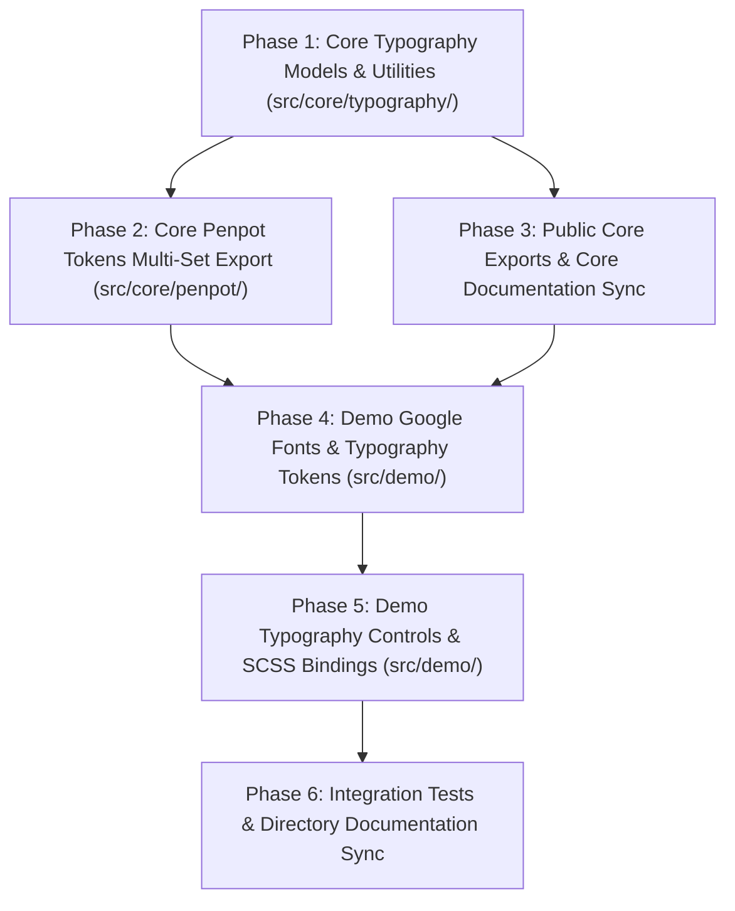

# Anima 0.3 Implementation Roadmap & Specifications

Based on the architectural specifications defined in [`docs/0.3.md`](./0.3.md), this document details the phased implementation roadmap for Anima 0.3 core typography modeling, Penpot multi-set design token export separation (`palette` and `theme`), composite typography tokens in the theme set, and interactive font customization in the demo application.

---

## 1. Dependency Graph

---

## 2. Phased Implementation Plan

### Phase 1: Core Typography Models & Utilities (`src/core/typography/`)

**Goal**: Create `src/core/typography/` with `TypographyValue`, `TypographySet`, canonical arrays, and the `getTypographyCssFont` formatter.  
**Dependencies**: None.

- [ ] **1. Phase 1: Core Typography Models & Utilities**
  - [ ] **1.1 Data Models & Formatters (`src/core/typography/typography.ts`)**
    - [ ] 1.1.1 Define `TypographyValue` interface with required `fontFamily`, `fontSize`, `fontWeight`, `lineHeight` and optional `letterSpacing`, `textCase`, `textDecoration`.
    - [ ] 1.1.2 Define `TypographyType` union and `TYPOGRAPHY_TYPES` constant array (`['body', 'display', 'headline', 'label', 'title']`).
    - [ ] 1.1.3 Define `TypographySize` union and `TYPOGRAPHY_SIZES` constant array (`['large', 'medium', 'small']`).
    - [ ] 1.1.4 Define `TypographySet` interface with 30 optional properties (`displayLarge`, `displayLargeCode`, etc.).
    - [ ] 1.1.5 Implement `getTypographyCssFont(value: TypographyValue): string` returning `${value.fontWeight} ${value.fontSize}/${value.lineHeight} ${value.fontFamily}`.
  - [ ] **1.2 Unit Testing (`src/core/typography/typography.test.ts`)**
    - [ ] 1.2.1 Verify `getTypographyCssFont` formats valid CSS `font` shorthand values.
  - [ ] **1.3 Directory Documentation (`src/core/typography/README.md`)**
    - [ ] 1.3.1 Create `src/core/typography/README.md` documenting `typography.ts`.

---

### Phase 2: Core Penpot Tokens Multi-Set Export (`src/core/penpot/`)

**Goal**: Separate Penpot export tokens into distinct `palette` and `theme` sets, and add composite typography tokens to the root of `theme`.  
**Dependencies**: Phase 1.

- [ ] **2. Phase 2: Core Penpot Tokens Multi-Set Export**
  - [ ] **2.1 Penpot Token Interfaces (`src/core/penpot/penpot.ts`)**
    - [ ] 2.1.1 Define `PenpotTypographyToken` interface (`$type: 'typography'`, `$value: { fontFamily, fontSize, fontWeight, lineHeight, ... }`).
    - [ ] 2.1.2 Update `PenpotTokenTree` to accept `PenpotColorToken | PenpotTokenTree | PenpotTypographyToken`.
    - [ ] 2.1.3 Define `PenpotExportData` with separate `palette: PenpotTokenTree` and `theme: PenpotTokenTree`.
  - [ ] **2.2 Generator Implementation (`src/core/penpot/get-penpot-tokens.ts`)**
    - [ ] 2.2.1 Update function signature to `getPenpotTokens(themeSet: ThemeSet, palettes: PaletteSet, typographySet: TypographySet, seedName: string): PenpotExportData`.
    - [ ] 2.2.2 Populate `palette` set with `black`, `white`, and all 5 palette groups (`highlight`, `neutral`, `error`, `warning`, `success`).
    - [ ] 2.2.3 Populate `theme` set with the 8 color theme groups referencing palette aliases `{palette.[palette_type].[shade]}`, `{palette.white}`, `{palette.black}`.
    - [ ] 2.2.4 Populate `theme` set with composite typography tokens directly at root: `theme[type][size] = { $type: 'typography', $value: ... }` and `theme[type][size].code = { $type: 'typography', $value: ... }`.
    - [ ] 2.2.5 Set `$metadata`: `tokenSetOrder: ['palette', 'theme']`, `activeSets: ['palette', 'theme']`.
  - [ ] **2.3 Unit Testing (`src/core/penpot/get-penpot-tokens.test.ts`)**
    - [ ] 2.3.1 Verify `palette` and `theme` sets exist with correct order and active sets in `$metadata`.
    - [ ] 2.3.2 Verify palette alias syntax `{palette...}`.
    - [ ] 2.3.3 Verify composite typography tokens in `theme` set with standard and nested `code` variants.
  - [ ] **2.4 Directory Documentation (`src/core/penpot/README.md`)**
    - [ ] 2.4.1 Update `src/core/penpot/README.md` to document typography tokens in `get-penpot-tokens.ts` and `penpot.ts`.

---

### Phase 3: Public Core Exports & Core Directory Documentation Sync

**Goal**: Re-export typography models and sync core directory documentation.  
**Dependencies**: Phase 1.

- [ ] **3. Phase 3: Public Core Exports & Core Directory Documentation Sync**
  - [ ] **3.1 Public Library Exports ([`src/index.ts`](../src/index.ts))**
    - [ ] 3.1.1 Export all declarations from `./core/typography/typography`.
  - [ ] **3.2 Core Directory Documentation ([`src/core/README.md`](../src/core/README.md))**
    - [ ] 3.2.1 Add `typography/` to subdirectories list in alphabetical order.

---

### Phase 4: Demo Google Fonts & Typography Custom Properties (`src/demo/`)

**Goal**: Implement curated Google Fonts lists, dynamic font loader, and typography CSS custom property generation.  
**Dependencies**: Phase 1, Phase 3.

- [ ] **4. Phase 4: Demo Google Fonts & Typography Custom Properties**
  - [ ] **4.1 Google Fonts Integration (`src/demo/google-fonts.ts`)**
    - [ ] 4.1.1 Define `TITLE_FONTS`, `BODY_FONTS`, and `CODE_FONTS` constant lists.
    - [ ] 4.1.2 Implement `loadGoogleFont(fontFamily: string): void` dynamically injecting `<link>` tags into document `<head>`.
  - [ ] **4.2 Typography Token Application (`src/demo/apply-typography-tokens.ts`)**
    - [ ] 4.2.1 Implement `getTypographyTokensCssProperties(typographySet: TypographySet): Record<string, string>` generating `--an-[type]-[size]-font` and `--an-[type]-[size]-code-font`.
    - [ ] 4.2.2 Implement `applyTypographyTokens(element: HTMLElement, typographySet: TypographySet): void` setting custom properties on the target element.
  - [ ] **4.3 Unit Testing (`src/demo/apply-typography-tokens.test.ts`)**
    - [ ] 4.3.1 Verify CSS custom property generation and element property application.

---

### Phase 5: Demo Typography Controls, SCSS Bindings & Export Sync (`src/demo/`)

**Goal**: Add typography customization UI controls in `<an-demo>`, bind demo elements to typography tokens in `demo.scss`, and sync Penpot download.  
**Dependencies**: Phase 2, Phase 4.

- [ ] **5. Phase 5: Demo Typography Controls, SCSS Bindings & Export Sync**
  - [ ] **5.1 Download Helper Update (`src/demo/download-penpot-tokens.ts`)**
    - [ ] 5.1.1 Update signature to `downloadPenpotTokens(themeSet: ThemeSet, palettes: PaletteSet, typographySet: TypographySet, seedName: string, filename: string): void`.
  - [ ] **5.2 Demo State & Reactive Typography (`src/demo/demo.ts`)**
    - [ ] 5.2.1 Add `titleFont` ('Montserrat'), `bodyFont` ('Roboto'), and `codeFont` ('JetBrains Mono') state signals.
    - [ ] 5.2.2 Add computed `typographySet: Signal.Computed<TypographySet>` with the 5 demo styles (`displayMedium`, `titleMedium`, `bodyMedium`, `bodyMediumCode`, `labelMedium`).
    - [ ] 5.2.3 Watch `this.typographySet` in `initWatcher()` and `cleanupWatcher()`.
    - [ ] 5.2.4 In `updated()` and watcher callback, call `applyTypographyTokens()` and `loadGoogleFont()`.
    - [ ] 5.2.5 Render Title, Body, and Code font family datalist inputs in the Typographies section.
    - [ ] 5.2.6 Pass `this.typographySet.get()` to `downloadPenpotTokens()` in `handleExportPenpotTokens()`.
  - [ ] **5.3 Scoped SCSS Typography Token Bindings (`src/demo/demo.scss`)**
    - [ ] 5.3.1 Bind `h1` to `var(--an-display-medium-font)`.
    - [ ] 5.3.2 Bind `h2` to `var(--an-title-medium-font)`.
    - [ ] 5.3.3 Bind `p, li` to `var(--an-body-medium-font)`.
    - [ ] 5.3.4 Bind `code` to `var(--an-body-medium-code-font)`.
    - [ ] 5.3.5 Bind `button` to `var(--an-label-medium-font)`.
    - [ ] 5.3.6 Style `.typography-controls` and control groups.

---

### Phase 6: Integration Tests & Directory Documentation Sync

**Goal**: Update integration tests, update `src/demo/README.md`, and verify test suite pass rate.  
**Dependencies**: Phase 5.

- [ ] **6. Phase 6: Integration Tests & Directory Documentation Sync**
  - [ ] **6.1 Integration Testing (`src/demo/demo.test.ts`)**
    - [ ] 6.1.1 Verify Penpot token export button passes typography tokens.
    - [ ] 6.1.2 Verify font input updates reactive state.
  - [ ] **6.2 Directory Documentation (`src/demo/README.md`)**
    - [ ] 6.2.1 Document `apply-typography-tokens.ts` and `google-fonts.ts`.
    - [ ] 6.2.2 Update descriptions of `demo.ts`, `demo.scss`, and `download-penpot-tokens.ts`.
  - [ ] **6.3 Full Suite Verification**
    - [ ] 6.3.1 Run `npm run build` and `npm run build:demo`.
    - [ ] 6.3.2 Run `npm run lint`.
    - [ ] 6.3.3 Run all unit and integration tests.

---

## 3. Verification & Acceptance Criteria

- All unit tests in `src/core/typography/`, `src/core/penpot/`, and `src/demo/` pass with zero failures.
- Zero TypeScript compile errors (`tsc --noEmit`).
- Zero ESLint linting errors (`eslint . --ext .ts --resolve-plugins-relative-to .`).
- Penpot export JSON contains both `palette` and `theme` sets, with valid `{palette...}` aliases and composite typography tokens under `theme`.
