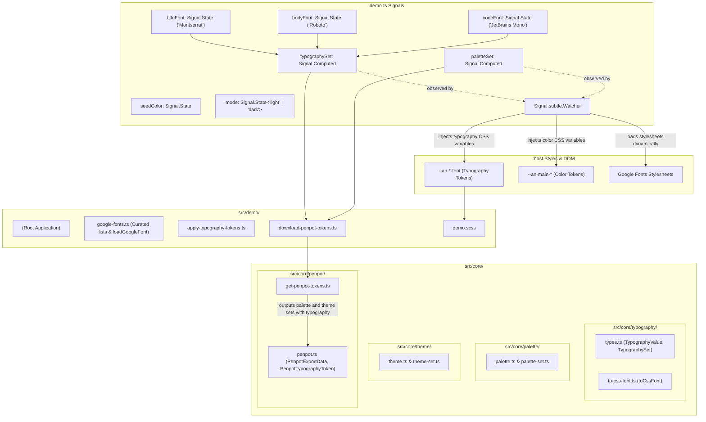

# Anima 0.3: Typography Design Tokens, Penpot Multi-Set Export & Typography Customization

## 1. Overview & Problem Statement

### 1.1 Context & Background

Anima 0.1 established perceptual color palette generation using the OKLCH color space and radial chroma gamut boundary sampling. Anima 0.2 expanded this foundation into a complete theme set architecture:

- Generating a 5-palette set (`highlight`, `neutral`, `error`, `warning`, `success`).
- Generating 8 accessible themes (Light 0–3 and Dark 0–3) with 7 semantic roles (`background`, `primary`, `secondary`, `display`, `error`, `warning`, `success`).
- Implementing the autonomous `<an-theme-preview>` Web Component, official brand icon, and interactive light/dark mode toggling.
- Adding initial Penpot design token export capabilities.

However, a design system requires more than color definitions; typography is equally fundamental to brand identity, visual hierarchy, and application interfaces.

### 1.2 Problem Statement

In the current state of Anima:

1. **Lack of Typography Design Tokens**: Typography definitions (font family, font size, font weight, line height, letter spacing, text case, and text decoration) are entirely absent from the core design token model and exported Penpot tokens.
2. **Penpot Token Organization**: Penpot design tokens should be organized into distinct, standard token sets (`palette` and `theme`) adhering to W3C Design Tokens Community Group (DTCG) and Tokens Studio multi-set specifications, rather than a collapsed single set.
3. **No Font Customization in Demo**: The showcase application uses static default system fonts without the ability to inspect how typography pairs with generated color themes or preview fonts live in the interface.
4. **Disjointed Demo Typography Styling**: Text elements (`h1`, `h2`, `p`, `code`, `button`) in `<an-demo>` rely on ad-hoc CSS rather than structured typography design tokens exposed as CSS custom properties.

### 1.3 Design Goals

- **Core Typography Module (`src/core/typography/`)**:
  - Introduce pure, DOM-independent typography data models and canonical constants:
    - `TypographyValue`: composite interface defining the 7 typography properties (`fontFamily`, `fontSize`, `fontWeight`, `lineHeight` required; `letterSpacing`, `textCase`, `textDecoration` optional).
    - `TypographyType`: `'body' | 'display' | 'headline' | 'label' | 'title'`.
    - `TypographySize`: `'large' | 'medium' | 'small'`.
    - `TypographySet`: interface with 30 optional properties covering standard and code variants (`displayLarge`, `displayLargeCode`, `displayMedium`, `displayMediumCode`, ..., `bodyMedium`, `bodyMediumCode`, ..., `labelSmall`, `labelSmallCode`).
    - `toCssFont(value: TypographyValue): string`: utility converting a `TypographyValue` into a CSS `font` shorthand string (`${fontWeight} ${fontSize}/${lineHeight} ${fontFamily}`).
- **Penpot Multi-Set Token Export Separation (`src/core/penpot/`)**:
  - `PenpotExportData` maintains two separate sets: `palette` and `theme`, with `$metadata.tokenSetOrder = ['palette', 'theme']` and `$metadata.activeSets = ['palette', 'theme']`.
  - Palette set contains base colors (`white`, `black`) and 9-shade swatches (`${seedName}_highlight`, `${seedName}_neutral`, `error`, `warning`, `success`).
  - Theme set contains the 8 color theme groups (`${seedName}-${mode}_${type}`) referencing palette swatches via `{palette.[palette_type].[shade]}`, `{palette.white}`, and `{palette.black}`.
  - Theme set includes composite typography tokens (`$type: 'typography'`) placed directly at the root (`theme[type][size]`), with the standard variant defined at `theme[type][size]` and the code variant nested as `theme[type][size].code`.
  - Signature: `getPenpotTokens(themeSet: ThemeSet, palettes: PaletteSet, typographySet: TypographySet, seedName: string): PenpotExportData`.
- **Demo Typography Customization & Live Preview (`src/demo/`)**:
  - Provide font family pickers for the 3 distinct typography roles demonstrated in the demo UI: Title/Heading font, Body font, and Code font.
  - Curate popular Google Fonts (e.g. Montserrat, Playfair Display, Inter, Poppins for Title; Roboto, Lato, Open Sans, Source Sans 3 for Body; JetBrains Mono, Fira Code, Source Code Pro for Code) selectable via datalist inputs.
  - Dynamically load chosen Google Fonts via `<link>` tags in `<head>` for live preview.
  - Pre-selected defaults: Title = `'Montserrat'`, Body = `'Roboto'`, Code = `'JetBrains Mono'`.
  - Populate demo `TypographySet` with constant metrics for the 5 styles used in the demo: `displayMedium` (h1), `titleMedium` (h2), `bodyMedium` (p, li), `bodyMediumCode` (code), `labelMedium` (buttons/controls).
- **CSS Custom Property Design Tokens**:
  - Emit `--an-[type]-[size]-font` and `--an-[type]-[size]-code-font` custom properties using the CSS `font` shorthand on `:host`.
  - Consume tokens in `demo.scss` for `h1`, `h2`, `p`, `li`, `code`, and `button`.
- **Penpot Export Integration**:
  - "Export Penpot tokens" exports the JSON file containing both color theme tokens and typography tokens in the `theme` set, and swatches in the `palette` set.

### 1.4 Non-Goals

- User customization of font metrics other than font family (font sizes, line heights, and weights remain canonical constants).
- Complex fluid typography clamp calculations or breakpoint-dependent type scaling.
- Component-level tokens (`--an-component-*`); deferred to a subsequent milestone.
- Querying live Google Fonts API endpoints requiring API keys or downloading external multimegabyte font databases.

---

## 2. Architecture & Reactive Data Flow

### 2.1 System Architecture Diagram



### 2.2 Component & Module Roles

1. **`src/core/typography/`**:
   - `types.ts`: Canonical interfaces and constants for typography definitions. Zero DOM dependencies.
   - `to-css-font.ts`: Exports `toCssFont`, a pure function converting a `TypographyValue` to CSS `font` shorthand.
2. **`src/core/penpot/`**:
   - `penpot.ts`: Interface models for Penpot export data structure, including `PenpotTypographyToken` and multi-set `PenpotExportData`.
   - `get-penpot-tokens.ts`: Generates the complete export envelope splitting swatches into `palette` and theme colors + typography composite tokens into `theme`.
3. **`src/demo/`**:
   - `google-fonts.ts`: Provides curated lists of font families and dynamically injects Google Fonts `<link>` tags into `<head>` upon selection.
   - `apply-typography-tokens.ts`: Maps `TypographySet` entries to `--an-[type]-[size]-font` and `--an-[type]-[size]-code-font` CSS custom properties on `:host`.
   - `download-penpot-tokens.ts`: Coordinates serializing and triggering browser download of Penpot token JSON containing palettes, color themes, and typography.
   - `demo.ts`: Houses reactive signals for seed color, mode, and chosen fonts; renders font family controls and integrates typography tokens into live demo watcher.
   - `demo.scss`: Binds HTML headings, paragraphs, code tags, and buttons to their corresponding typography tokens via CSS custom properties.

---

## 3. Typography & Token Schema

### 3.1 Typography Properties Specification

Each typography style in Anima is represented as a composite token adhering to the Penpot composite typography specification:

| Property         | Type                                                   | Required | Description                    | Example                    |
| :--------------- | :----------------------------------------------------- | :------- | :----------------------------- | :------------------------- |
| `fontFamily`     | `string`                                               | **Yes**  | Font family name or font stack | `'Montserrat', sans-serif` |
| `fontSize`       | `string`                                               | **Yes**  | Font size with units (`px`)    | `'14px'`, `'45px'`         |
| `fontWeight`     | `number \| string`                                     | **Yes**  | Numeric weight or keyword      | `400`, `500`               |
| `lineHeight`     | `number \| string`                                     | **Yes**  | Unitless multiplier or size    | `1.5`, `1.2`               |
| `letterSpacing`  | `number \| string`                                     | No       | Character horizontal spacing   | `0`, `'0.5px'`             |
| `textCase`       | `'none' \| 'uppercase' \| 'lowercase' \| 'capitalize'` | No       | Capitalization transformation  | `'none'`                   |
| `textDecoration` | `'none' \| 'underline' \| 'strike-through'`            | No       | Text line decoration           | `'none'`                   |

### 3.2 Penpot Token Sets Hierarchy

Penpot tokens are exported in a JSON structure containing two active sets: `palette` and `theme`.

```json
{
  "$metadata": {
    "activeSets": ["palette", "theme"],
    "tokenSetOrder": ["palette", "theme"]
  },
  "palette": {
    "white": { "$type": "color", "$value": "#ffffff" },
    "black": { "$type": "color", "$value": "#000000" },
    "main_highlight": {
      "100": { "$type": "color", "$value": "#fef3c7" },
      "...": { "..." },
      "900": { "$type": "color", "$value": "#78350f" }
    },
    "main_neutral": { "...": "..." },
    "error": { "...": "..." },
    "warning": { "...": "..." },
    "success": { "...": "..." }
  },
  "theme": {
    "main-light_0": {
      "background": { "$type": "color", "$value": "{palette.main_neutral.100}" },
      "primary": { "$type": "color", "$value": "{palette.main_neutral.900}" },
      "secondary": { "$type": "color", "$value": "{palette.main_neutral.700}" },
      "display": { "$type": "color", "$value": "{palette.main_highlight.500}" },
      "error": { "$type": "color", "$value": "{palette.error.600}" },
      "warning": { "$type": "color", "$value": "{palette.warning.600}" },
      "success": { "$type": "color", "$value": "{palette.success.600}" }
    },
    "main-light_1": { "...": "..." },
    "main-dark_0": { "...": "..." },
    "display": {
      "medium": {
        "$type": "typography",
        "$value": {
          "fontFamily": "Montserrat",
          "fontSize": "45px",
          "fontWeight": 400,
          "lineHeight": 1.2
        }
      }
    },
    "title": {
      "medium": {
        "$type": "typography",
        "$value": {
          "fontFamily": "Montserrat",
          "fontSize": "16px",
          "fontWeight": 500,
          "lineHeight": 1.4
        }
      }
    },
    "body": {
      "medium": {
        "$type": "typography",
        "$value": {
          "fontFamily": "Roboto",
          "fontSize": "14px",
          "fontWeight": 400,
          "lineHeight": 1.5
        },
        "code": {
          "$type": "typography",
          "$value": {
            "fontFamily": "JetBrains Mono",
            "fontSize": "14px",
            "fontWeight": 400,
            "lineHeight": 1.5
          }
        }
      }
    },
    "label": {
      "medium": {
        "$type": "typography",
        "$value": {
          "fontFamily": "Roboto",
          "fontSize": "12px",
          "fontWeight": 500,
          "lineHeight": 1.4
        }
      }
    }
  }
}
```

### 3.3 CSS Custom Properties Naming Schema

In accordance with Anima's token naming rules (omitting category keywords `palette` and `theme`), typography tokens are exposed as:

- Standard variant: `--an-[type]-[size]-font`
- Code variant: `--an-[type]-[size]-code-font`

Value format:

```css
/* [font-weight] [font-size]/[line-height] [font-family] */
--an-display-medium-font: 400 45px/1.2 'Montserrat', sans-serif;
--an-title-medium-font: 500 16px/1.4 'Montserrat', sans-serif;
--an-body-medium-font: 400 14px/1.5 'Roboto', sans-serif;
--an-body-medium-code-font: 400 14px/1.5 'JetBrains Mono', monospace;
--an-label-medium-font: 500 12px/1.4 'Roboto', sans-serif;
```

---

## 4. Typesafe Interfaces (Interface-Only Specification)

### 4.1 Typography Module Interfaces (`src/core/typography/types.ts` & `src/core/typography/to-css-font.ts`)

```typescript
export interface TypographyValue {
  readonly fontFamily: string;
  readonly fontSize: string;
  readonly fontWeight: number | string;
  readonly letterSpacing?: number | string;
  readonly lineHeight: number | string;
  readonly textCase?: 'capitalize' | 'lowercase' | 'none' | 'uppercase';
  readonly textDecoration?: 'none' | 'strike-through' | 'underline';
}

export type TypographyType =
  'body' | 'display' | 'headline' | 'label' | 'title';

export const TYPOGRAPHY_TYPES: readonly TypographyType[] = [
  'body',
  'display',
  'headline',
  'label',
  'title',
];

export type TypographySize = 'large' | 'medium' | 'small';

export const TYPOGRAPHY_SIZES: readonly TypographySize[] = [
  'large',
  'medium',
  'small',
];

export interface TypographySet {
  readonly bodyLarge?: TypographyValue;
  readonly bodyLargeCode?: TypographyValue;
  readonly bodyMedium?: TypographyValue;
  readonly bodyMediumCode?: TypographyValue;
  readonly bodySmall?: TypographyValue;
  readonly bodySmallCode?: TypographyValue;
  readonly displayLarge?: TypographyValue;
  readonly displayLargeCode?: TypographyValue;
  readonly displayMedium?: TypographyValue;
  readonly displayMediumCode?: TypographyValue;
  readonly displaySmall?: TypographyValue;
  readonly displaySmallCode?: TypographyValue;
  readonly headlineLarge?: TypographyValue;
  readonly headlineLargeCode?: TypographyValue;
  readonly headlineMedium?: TypographyValue;
  readonly headlineMediumCode?: TypographyValue;
  readonly headlineSmall?: TypographyValue;
  readonly headlineSmallCode?: TypographyValue;
  readonly labelLarge?: TypographyValue;
  readonly labelLargeCode?: TypographyValue;
  readonly labelMedium?: TypographyValue;
  readonly labelMediumCode?: TypographyValue;
  readonly labelSmall?: TypographyValue;
  readonly labelSmallCode?: TypographyValue;
  readonly titleLarge?: TypographyValue;
  readonly titleLargeCode?: TypographyValue;
  readonly titleMedium?: TypographyValue;
  readonly titleMediumCode?: TypographyValue;
  readonly titleSmall?: TypographyValue;
  readonly titleSmallCode?: TypographyValue;
}

export function toCssFont(value: TypographyValue): string;
```

### 4.2 Penpot Module Interfaces (`src/core/penpot/penpot.ts`)

```typescript
export interface PenpotColorToken {
  readonly $description?: string;
  readonly $type: 'color';
  readonly $value: string;
}

export interface PenpotTypographyToken {
  readonly $description?: string;
  readonly $type: 'typography';
  readonly $value: {
    readonly fontFamily: string;
    readonly fontSize: string;
    readonly fontWeight: number | string;
    readonly letterSpacing?: number | string;
    readonly lineHeight: number | string;
    readonly textCase?: string;
    readonly textDecoration?: string;
  };
  readonly [key: string]: unknown;
}

export type PenpotTokenTree = {
  readonly [key: string]:
    PenpotColorToken | PenpotTokenTree | PenpotTypographyToken;
};

export interface PenpotExportData {
  readonly $metadata?: {
    readonly activeSets?: readonly string[];
    readonly tokenSetOrder: readonly string[];
  };
  readonly palette: PenpotTokenTree;
  readonly theme: PenpotTokenTree;
}
```

---

## 5. Demo Application Architecture & Font Customization

### 5.1 Curated Google Fonts & Dynamic Loader (`src/demo/google-fonts.ts`)

The demo provides curated font selections categorized by role:

- **Title / Heading**: `Montserrat`, `Inter`, `Merriweather`, `Oswald`, `Playfair Display`, `Poppins`, `Raleway`.
- **Body**: `Roboto`, `Lato`, `Noto Sans`, `Nunito`, `Open Sans`, `Source Sans 3`.
- **Code**: `JetBrains Mono`, `Fira Code`, `Inconsolata`, `Roboto Mono`, `Source Code Pro`.

`loadGoogleFont(fontFamily: string): void` dynamically appends a `<link>` stylesheet element to document `<head>` to load variable font weights (`300..900`).

### 5.2 Typography Customization UI (`src/demo/demo.ts`)

Inside the Typographies section of `<an-demo>`, three input controls with associated `<datalist>` elements allow users to customize:

1. **Title / Heading Font**: updates `titleFont: Signal.State<string>`.
2. **Body Font**: updates `bodyFont: Signal.State<string>`.
3. **Code Font**: updates `codeFont: Signal.State<string>`.

`typographySet: Signal.Computed<TypographySet>` reactively re-evaluates and passes the configured font styles into `applyTypographyTokens(this, ...)` and `downloadPenpotTokens(...)`.

### 5.3 Element Font Bindings (`src/demo/demo.scss`)

Demo elements consume typography custom properties directly:

```scss
h1 {
  font: var(--an-display-medium-font);
}

h2 {
  font: var(--an-title-medium-font);
}

p,
li {
  font: var(--an-body-medium-font);
}

code {
  font: var(--an-body-medium-code-font);
}

button {
  font: var(--an-label-medium-font);
}
```

---

## 6. Testing & Verification Strategy

1. **Unit Testing (`src/core/typography/to-css-font.test.ts`)**:
   - Verify `toCssFont` generates correct CSS `font` shorthand strings.
2. **Unit Testing (`src/core/penpot/get-penpot-tokens.test.ts`)**:
   - Verify `$metadata.tokenSetOrder` and `activeSets` contain `['palette', 'theme']`.
   - Verify `palette` set contains black, white, and all 5 palette groups.
   - Verify `theme` set contains all 8 theme groups with aliases `{palette...}`.
   - Verify `theme` set contains composite typography tokens with `$type: 'typography'` and nested `code` variant.
3. **Unit Testing (`src/demo/apply-typography-tokens.test.ts`)**:
   - Verify CSS custom properties dictionary generation and application on elements.
4. **Integration Testing (`src/demo/demo.test.ts`)**:
   - Verify font selection inputs update demo state and trigger Penpot export with full typography tokens.
