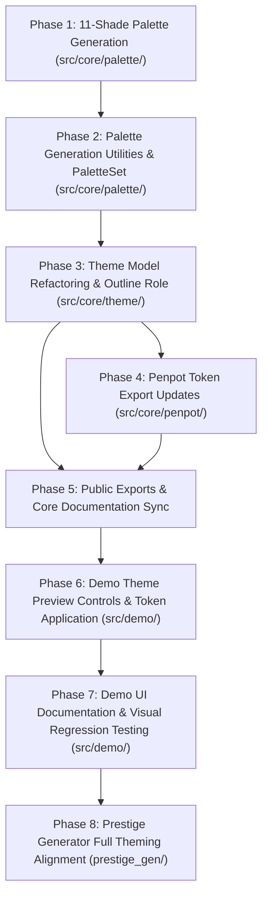

# Anima 0.4 Implementation Roadmap & Specifications

Based on the architectural specifications defined in [`docs/0.4.md`](./0.4.md), this document details the phased implementation roadmap for Anima 0.4: 11-shade gamut boundary palette generation (`c50` and `c950`), `createNeutralPalette` and `PaletteSet` architecture, pure `Theme` types with the `outline` role, interactive demo theme customization, and `prestige_gen` full theming alignment.

---

## 1. Dependency Graph

---

## 2. Phased Implementation Plan

### Phase 1: 11-Shade Palette Generation (`src/core/palette/`)

**Goal**: Extend `Palette` and `createPalette` to generate 11 shades including `c50` ($L=0.980$) and `c950` ($L=0.150$).  
**Dependencies**: None.

- [x] **1. Phase 1: 11-Shade Palette Generation**
  - [x] **1.1 Data Models (`src/core/palette/palette.ts`)**
    - [x] 1.1.1 Add `c50` and `c950` properties to `Palette` interface.
    - [x] 1.1.2 Update `SHADE_KEYS` to include `'c50'` and `'c950'`.
  - [x] **1.2 Generator Algorithm (`src/core/palette/create-palette.ts`)**
    - [x] 1.2.1 Add target lightness $L=0.980$ for `c50` and $L=0.150$ for `c950` in `createPalette`.
  - [x] **1.3 Unit Testing (`src/core/palette/create-palette.test.ts`)**
    - [x] 1.3.1 Verify all 11 shades are generated and monotonically decreasing in lightness.
    - [x] 1.3.2 Verify `c50` and `c950` relative luminance and sRGB gamut conformance.
  - [x] **1.4 Directory Documentation (`src/core/palette/README.md`)**
    - [x] 1.4.1 Update `src/core/palette/README.md` to document the 11-shade structure.

---

### Phase 2: Palette Generation Utilities & PaletteSet (`src/core/palette/`)

**Goal**: Implement `createNeutralPalette`, update `PaletteSet` interface (`main`, `neutral`, `error`, `warning`, `success`, `other`, `black`, `white`), and delete `create-seeded-palette-set.ts`, `seeded-palette-set.ts`, and `create-palette-set.ts`.  
**Dependencies**: Phase 1.

- [ ] **2. Phase 2: Palette Generation Utilities & PaletteSet**
  - [ ] **2.1 Neutral Palette Generator (`src/core/palette/create-neutral-palette.ts`)**
    - [ ] 2.1.1 Implement `createNeutralPalette(seed: Color): Palette` setting HSL saturation to `0.05` and delegating to `createPalette`.
  - [ ] **2.2 Interface Definition (`src/core/palette/palette-set.ts`)**
    - [ ] 2.2.1 Define `PaletteSet` with `black`, `white`, `main`, `neutral`, `error`, `warning`, `success`, and `other: ReadonlyMap<string, Palette>`.
    - [ ] 2.2.2 Delete `create-seeded-palette-set.ts`, `seeded-palette-set.ts`, and `create-palette-set.ts`.
  - [ ] **2.3 Unit Testing (`src/core/palette/create-neutral-palette.test.ts`)**
    - [ ] 2.3.1 Verify `createNeutralPalette` produces 11 low-saturation shades from any seed color.
  - [ ] **2.4 Directory Documentation (`src/core/palette/README.md`)**
    - [ ] 2.4.1 Update `src/core/palette/README.md` reflecting `createNeutralPalette`, the updated `PaletteSet`, and deleted files.

---

### Phase 3: Theme Model Refactoring & Outline Role (`src/core/theme/`)

**Goal**: Rename `border` role to `outline`, retain pure `Theme` and `ThemeSet` interfaces, and delete `createThemeSet` factory.  
**Dependencies**: Phase 2.

- [ ] **3. Phase 3: Theme Model Refactoring & Outline Role**
  - [ ] **3.1 Theme Types (`src/core/theme/theme.ts`)**
    - [ ] 3.1.1 Rename `border` to `outline` in `ThemeSection`, `SECTIONS`, and `Theme` interface.
    - [ ] 3.1.2 Update `PaletteKey` to `'main' | 'neutral' | 'error' | 'warning' | 'success' | string`.
    - [ ] 3.1.3 Update `isShadeKey` to validate all 11 shades (`c50` to `c950`).
    - [ ] 3.1.4 Update `resolveThemeColor` to resolve colors from `palettes.main`, `palettes.neutral`, `palettes.other`, status palettes, and base colors.
    - [ ] 3.1.5 Update `getPaletteCssVar` to emit `--an-[palette]-[shade]` without seed name prefixes.
  - [ ] **3.2 Theme Set Interface (`src/core/theme/theme-set.ts`)**
    - [ ] 3.2.1 Keep pure `ThemeSet` interface (`light: Record<ThemeType, Theme>`, `dark: Record<ThemeType, Theme>`) and delete `createThemeSet`.
  - [ ] **3.3 Unit Testing (`src/core/theme/theme.test.ts`)**
    - [ ] 3.3.1 Verify color resolution and CSS variable names for all 11 shades and `outline`.
  - [ ] **3.4 Directory Documentation (`src/core/theme/README.md`)**
    - [ ] 3.4.1 Update `src/core/theme/README.md` reflecting `outline` and `ThemeSet`.

---

### Phase 4: Penpot Token Export Updates (`src/core/penpot/`)

**Goal**: Update Penpot token generation for the new `PaletteSet`, `outline` role, and 11 shades.  
**Dependencies**: Phase 3.

- [ ] **4. Phase 4: Penpot Token Export Updates**
  - [ ] **4.1 Palette Token Tree (`src/core/penpot/palette-set-to-penpot-token-tree.ts`)**
    - [ ] 4.1.1 Export `main`, `neutral`, `error`, `warning`, `success`, `other`, `white`, and `black` swatches with shades `50` through `950`.
  - [ ] **4.2 Theme Token Tree (`src/core/penpot/theme-set-to-penpot-token-tree.ts`)**
    - [ ] 4.2.1 Update theme tokens to emit `outline` instead of `border`, referencing `{main.50}`, `{neutral.100}`, etc.
  - [ ] **4.3 Unit Testing (`src/core/penpot/palette-set-to-penpot-token-tree.test.ts` & `src/core/penpot/theme-set-to-penpot-token-tree.test.ts`)**
    - [ ] 4.3.1 Verify Penpot token tree structure, alias syntax, and 11 shades.
  - [ ] **4.4 Directory Documentation (`src/core/penpot/README.md`)**
    - [ ] 4.4.1 Update `src/core/penpot/README.md` to reflect token tree changes.

---

### Phase 5: Public Exports & Core Documentation Sync

**Goal**: Export all updated contracts from `src/index.ts` and sync `src/core/README.md`.  
**Dependencies**: Phase 2, Phase 3, Phase 4.

- [ ] **5. Phase 5: Public Exports & Core Documentation Sync**
  - [ ] **5.1 Public Library Exports ([`src/index.ts`](../src/index.ts))**
    - [ ] 5.1.1 Export `createNeutralPalette` and remove deleted `create-seeded-palette-set`, `seeded-palette-set`, and `create-palette-set`.
  - [ ] **5.2 Core Directory Documentation ([`src/core/README.md`](../src/core/README.md))**
    - [ ] 5.2.1 Proactively verify and update directory listings.

---

### Phase 6: Demo Theme Preview Controls & Token Application (`src/demo/`)

**Goal**: Add interactive shade dropdowns with contrast ratios to `<an-theme-preview>` and update `applyThemeTokens`.  
**Dependencies**: Phase 3, Phase 5.

- [ ] **6. Phase 6: Demo Theme Preview Controls & Token Application**
  - [ ] **6.1 Token Application (`src/demo/apply-theme-tokens.ts`)**
    - [ ] 6.1.1 Update CSS custom properties generation for `--an-main-[shade]`, `--an-neutral-[shade]`, and `--an-main-[mode]_[type]-outline`.
  - [ ] **6.2 Theme Preview Component (`src/demo/component/theme-preview/theme-preview.ts` & `scss`)**
    - [ ] 6.2.1 Add inline `<select>` dropdowns for each role (`background`, `outline`, `primary`, `secondary`, `display`, `error`, `warning`, `success`).
    - [ ] 6.2.2 Populate each foreground option with shade label and calculated contrast ratio against the current background (`${shade} (${ratio.toFixed(2)}:1)`).
    - [ ] 6.2.3 Restrict background dropdown options per theme type (`neutral` for 0/1, `main` for 2/3).
    - [ ] 6.2.4 Emit `theme-change` event when any role shade is modified.
    - [ ] 6.2.5 Update styles for `outline` styling and dropdowns.
  - [ ] **6.3 Demo Application Coordination (`src/demo/demo.ts` & `src/demo/demo.scss`)**
    - [ ] 6.3.1 Define initial `ThemeSet` in demo signals and update reactively on `theme-change`.
    - [ ] 6.3.2 Construct `paletteSet` directly using `createPalette` and `createNeutralPalette`.
    - [ ] 6.3.3 Update demo styles from `border` to `outline`.
  - [ ] **6.4 Unit Testing (`src/demo/apply-theme-tokens.test.ts` & component tests)**
    - [ ] 6.4.1 Verify CSS property emission and component event dispatching.

---

### Phase 7: Demo UI Documentation & Visual Regression Testing (`src/demo/`)

**Goal**: Update demo documentation copy (tables, descriptions) and regenerate/verify visual regression goldens.  
**Dependencies**: Phase 6.

- [ ] **7. Phase 7: Demo UI Documentation & Visual Regression Testing**
  - [ ] **7.1 Documentation Copy (`src/demo/demo.ts`)**
    - [ ] 7.1.1 Update shades table to include 11 shades (`50` and `950`).
    - [ ] 7.1.2 Update palette descriptions (`main`, `neutral`, `other`, status).
    - [ ] 7.1.3 Update theme descriptions with `outline` and contrast requirements.
  - [ ] **7.2 Visual Regression & Golden Checks**
    - [ ] 7.2.1 Run `./scripts/run_tests.sh` (or `npm test`) in non-headless mode.
    - [ ] 7.2.2 Follow golden review workflow if UI visual goldens change.
  - [ ] **7.3 Directory Documentation (`src/demo/README.md`)**
    - [ ] 7.3.1 Update `src/demo/README.md` and component READMEs.

---

### Phase 8: Prestige Generator Full Theming Alignment (`prestige_gen/`)

**Goal**: Align `prestige_gen` with Anima 0.4: neutral sharing the general seed (`#C97424`), domain palettes, 11-shade swatches, and GDScript constants.  
**Dependencies**: Phase 5.

- [ ] **8. Phase 8: Prestige Generator Full Theming Alignment**
  - [ ] **8.1 Penpot Token Writer (`prestige_gen/src/theming/write-penpot-tokens.ts`)**
    - [ ] 8.1.1 Use `createPalette(rgb('#C97424'))` for `main`, `createNeutralPalette(rgb('#C97424'))` for `neutral`, and domain seeds in `other`.
    - [ ] 8.1.2 Define Prestige's `ThemeSet` manually and update Penpot token export.
  - [ ] **8.2 Swatch Generator & GDScript (`prestige_gen/src/theming/write-swatches.ts`)**
    - [ ] 8.2.1 Update swatch generation and `generateGdScript` to emit `*_50` and `*_950` constants in `palettes.gd`.
  - [ ] **8.3 Unit Testing & Build (`prestige_gen/`)**
    - [ ] 8.3.1 Run `npm test` and `npm run build` in `prestige_gen`.
    - [ ] 8.3.2 Verify generated Penpot tokens and GDScript output.
  - [ ] **8.4 Documentation Sync (`prestige_gen/README.md` & `prestige_gen/src/theming/README.md`)**
    - [ ] 8.4.1 Update documentation in `prestige_gen`.
