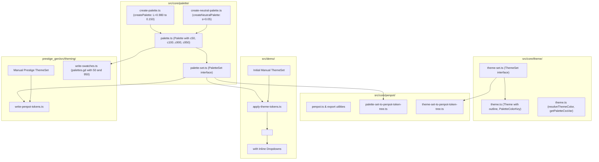

# Anima 0.4: Theme Set Redesign, 11-Shade Gamut Palettes & Contrast-Driven Theming

## 1. Overview & Problem Statement

### 1.1 Context & Background

Anima 0.1 through 0.3 established perceptual color palette generation using radial chroma boundary sampling in OKLCH color space, an 8-theme architecture (Light 0–3 and Dark 0–3), multi-set Penpot design token export (`palette` and `theme`), and typography design tokens.

In Anima 0.2/0.3:
- Palettes were organized as a `PaletteSet` with fixed semantic palettes (`error`, `warning`, `success`), base colors (`white`, `black`), and `seededPaletteSets` mapping seed names to `highlight` and `neutral` palettes.
- The `neutral` palette was derived strictly from `seedColor` by reducing saturation to 0.05 in HSL space, forcing neutral tones to share the exact hue of the highlight palette.
- Palettes were limited to 9 shades (`c100` through `c900`).
- Themes used hardcoded shade assignments (e.g. `c800` for background in dark theme 0, `c100` for primary).
- The structural outline/divider role was named `border`.
- Consumers like `prestige_gen` had to work around these limitations (e.g. maintaining a separate swatch pipeline for independent neutral seeds and domain palettes).

### 1.2 Problem Statement

1. **Inflexible Palette Composition**: `PaletteSet` couples `highlight` and `neutral` under a shared seed name, preventing independent neutral hues and domain-specific palettes (`other`).
2. **Missing Boundary Shades (`50` and `950`)**: High-contrast, modern UI designs require near-white (`c50`) and near-black (`c950`) shades for subtle surface elevation, card wells, and contrast-safe text.
3. **Prescriptive Core Themes**: The core library attempted to prescribe fixed shades for themes rather than providing pure types and resolution utilities, while allowing consumers to manually select shades that satisfy background hierarchy and contrast requirements.
4. **Rigid Border Role**: The `border` role is too specific; modern design systems require a generic `outline` role covering borders, focus rings, and dividers.
5. **No Theme Customization in Demo**: Users cannot adjust theme shades or inspect live contrast compliance against the background.
6. **Prestige Generator Divergence**: `prestige_gen` maintains legacy swatch generation with hardcoded 9-shade swatches and independent neutral seeds that are desynchronized from Anima's core models.

### 1.3 Design Goals

- **11-Shade Gamut Palettes (`src/core/palette/`)**:
  - Extend `Palette` with `c50` (target OKLCH $L = 0.980$) and `c950` (target OKLCH $L = 0.150$).
  - Update `SHADE_KEYS` to 11 shades (`c50`, `c100`, `c200`, ..., `c900`, `c950`).
- **Streamlined Palette Generation Utilities (`src/core/palette/`)**:
  - `createPalette(seed: Color): Palette`: Radial gamut boundary sampling generating all 11 shades from any seed color.
  - `createNeutralPalette(seed: Color): Palette`: Generates the 11-shade neutral palette from any seed color (reducing HSL saturation to `0.05`).
  - `PaletteSet` interface contains: `black`, `white`, `main`, `neutral`, `error`, `warning`, `success`, and `other: ReadonlyMap<string, Palette>`.
  - Consumers assemble `PaletteSet` directly from palette generator functions.
  - Delete `createSeededPaletteSet`, `SeededPaletteSet`, and `createPaletteSet`.
- **Pure Theme Types & `outline` Role (`src/core/theme/`)**:
  - Rename `border` role to `outline` across `Theme`, `ThemeSection`, CSS variables, and Penpot tokens.
  - Keep `src/core/theme/` strictly focused on types (`Theme`, `ThemeSet`, `ThemeSection`, `PaletteColorKey`) and color resolution utilities (`resolveThemeColor`, `getPaletteCssVar`). No hardcoded default `THEME_SET` or factory functions in the core library.
  - Theme Requirements for manual shade selection:
    - Background Ordering Requirements:
      - Light Mode: Theme 1 is `neutral` (base); Theme 0 is `neutral` (darker than 1); Theme 2 is `main` (darker than 1); Theme 3 is `main` (darker than 2).
      - Dark Mode: Theme 1 is `neutral` (base); Theme 0 is `neutral` (lighter than 1); Theme 2 is `main` (lighter than 1); Theme 3 is `main` (lighter than 2).
    - Minimum Contrast Ratio Requirements (against background):
      - `primary`: $\ge 4.5:1$
      - `secondary`: $\ge 4.5:1$
      - `status` (`error`, `warning`, `success`): $\ge 4.5:1$
      - `display`: $\ge 3.0:1$
      - `outline`: $\ge 1.5:1$
- **Interactive Theme Customization in Demo (`src/demo/`)**:
  - Manually define initial themes in the showcase application.
  - Derive `neutral` seed from `main` in the demo using `createNeutralPalette(mainSeed)`.
  - Update demo documentation, shade tables, and role descriptions.
  - Embed inline dropdowns in each `<an-theme-preview>` card for all roles.
  - Show live contrast ratio alongside each shade option (e.g. `c100 (11.23:1)`).
- **Full Theming Alignment in `prestige_gen`**:
  - Update `write-penpot-tokens.ts`:
    - `main` = `createPalette(rgb('#C97424'))`
    - `neutral` = `createNeutralPalette(rgb('#C97424'))` (same seed as general)
    - Domain colors assembled into `other`
    - Manually defines Prestige's `ThemeSet`
  - Update `write-swatches.ts` and `palettes.gd` generation to support `50` and `950` shades.

---

## 2. Architecture & Data Flow

### 2.1 System Architecture Diagram



---

## 3. Detailed Specifications

### 3.1 11-Shade Gamut Palette

`Palette` interface:
```typescript
export interface Palette {
  readonly c50: Color;
  readonly c100: Color;
  readonly c200: Color;
  readonly c300: Color;
  readonly c400: Color;
  readonly c500: Color;
  readonly c600: Color;
  readonly c700: Color;
  readonly c800: Color;
  readonly c900: Color;
  readonly c950: Color;
}

export type ShadeKey = keyof Palette;
export const SHADE_KEYS: readonly ShadeKey[] = [
  'c50',
  'c100',
  'c200',
  'c300',
  'c400',
  'c500',
  'c600',
  'c700',
  'c800',
  'c900',
  'c950',
];
```

OKLCH target lightness table:
| Shade | Target Lightness ($L$) | Description |
| :--- | :--- | :--- |
| `c50` | 0.980 | Near-white boundary shade |
| `c100` | 0.960 | Lightest surface tint |
| `c200` | 0.865 | Light highlight |
| `c300` | 0.770 | Muted light |
| `c400` | 0.675 | Medium light |
| `c500` | 0.580 | Core base chroma shade |
| `c600` | 0.485 | Medium dark |
| `c700` | 0.390 | Muted dark |
| `c800` | 0.295 | Dark highlight |
| `c900` | 0.200 | Darkest surface tint |
| `c950` | 0.150 | Near-black boundary shade |

### 3.2 Palette Generators & PaletteSet Data Model

```typescript
export function createPalette(seed: Color): Palette;

export function createNeutralPalette(seed: Color): Palette;

export interface PaletteSet {
  readonly black: Color;
  readonly error: Palette;
  readonly main: Palette;
  readonly neutral: Palette;
  readonly other: ReadonlyMap<string, Palette>;
  readonly success: Palette;
  readonly warning: Palette;
  readonly white: Color;
}
```

Semantic palettes (`error`, `warning`, `success`) are generated via standard constant seeds (`#dc2626`, `#d97706`, `#16a34a`). Base colors `white` and `black` are `#ffffff` and `#000000`.

### 3.3 Theme & Roles Specification

`ThemeSection`, `Theme`, and `ThemeSet`:
```typescript
export type ThemeSection =
  | 'background'
  | 'display'
  | 'error'
  | 'outline'
  | 'primary'
  | 'secondary'
  | 'success'
  | 'warning';

export const SECTIONS: readonly ThemeSection[] = [
  'background',
  'display',
  'error',
  'outline',
  'primary',
  'secondary',
  'success',
  'warning',
];

export interface Theme {
  readonly background: PaletteColorKey;
  readonly display: PaletteColorKey;
  readonly error: PaletteColorKey;
  readonly mode: ThemeMode;
  readonly outline: PaletteColorKey;
  readonly primary: PaletteColorKey;
  readonly secondary: PaletteColorKey;
  readonly success: PaletteColorKey;
  readonly type: ThemeType;
  readonly warning: PaletteColorKey;
}

export interface ThemeSet {
  readonly dark: Record<ThemeType, Theme>;
  readonly light: Record<ThemeType, Theme>;
}
```

### 3.4 Design Tokens Naming

- **Palette CSS Custom Properties**:
  - `--an-main-[shade]` (e.g. `--an-main-50`, `--an-main-950`)
  - `--an-neutral-[shade]` (e.g. `--an-neutral-50`, `--an-neutral-950`)
  - `--an-error-[shade]`, `--an-warning-[shade]`, `--an-success-[shade]`
  - `--an-[otherName]-[shade]` (e.g. `--an-food-500`)
  - `--an-black`, `--an-white`
- **Theme CSS Custom Properties**:
  - `--an-main-[mode]_[type]-[section]` where section is `background`, `outline`, `display`, `primary`, `secondary`, `error`, `warning`, `success`.
- **Penpot Tokens**:
  - Palette set: `{main.50}`..`{main.950}`, `{neutral.50}`..`{neutral.950}`, `{food.50}`, `{black}`, `{white}`.
  - Theme set: Aliases referencing palette tokens; role `outline` emitted as `{outline: { $type: 'color', $value: '...' }}`.

### 3.5 Demo Showcase Enhancements

- Manually defines initial accessible `ThemeSet` in demo application.
- `<an-theme-preview>` renders interactive dropdowns on every role.
- Each dropdown option displays `${shadeKey} (${ratio.toFixed(2)}:1)` calculated against the current background color.
- Emits custom event `theme-change` on selection.
- `<an-demo>` binds the updated theme reactively, refreshing `:host` CSS variables and preview cards.
- Demo documentation updated with 11-shade table, background hierarchy, and contrast rules.

### 3.6 Prestige Generator Integration

- `prestige_gen/src/theming/write-penpot-tokens.ts`:
  - `main = createPalette(rgb(PRESTIGE_SEED_COLORS.get('general')))`
  - `neutral = createNeutralPalette(rgb(PRESTIGE_SEED_COLORS.get('general')))` (same seed as general)
  - `other` = `food`, `production`, `military`, `science`, `prestige`, `commerce`, `diplomacy`, `culture`.
  - Manually defines Prestige's `ThemeSet`.
  - Exports Penpot base tokens with new `PaletteSet` and `ThemeSet`.
- `prestige_gen/src/theming/write-swatches.ts`:
  - `palettes.gd` output updated with `_50` and `_950` constants.
  - Swatch models and ASE encoding updated for 11 shades.
- Tests updated and verified.
